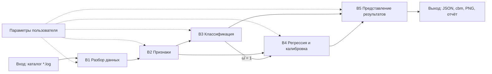

# Блок-схема программного комплекса (п. 4.1)

Документ задаёт логическую архитектуру комплекса калибровки DAK: состав блоков, их ответственность, форматы данных на границах и направление обмена. По этому описанию строится **рисунок 4.1** (`figures/fig_4_1_architecture.png`, скрипт `generate_figures.py`).

---

## Общая идея

Комплекс разбит на **пять функциональных блоков** и два внешних контура (**вход** и **выход**). Обработка идёт слева направо: сырой log превращается в объекты «сессия — кривая», по ним считаются признаки, затем два параллельных контура машинного обучения (классификация качества и регрессия концентрации), после чего результаты собираются в интерфейсе и файлах для прошивки.

Конфигурация (пути к каталогам, уровни L_m, порог τ, гиперпараметры CatBoost) поступает из блока **«Параметры пользователя»** во все блоки, где нужны настройки; на схеме это показано пунктирными связями.



---

## Внешние контуры

### Вход (IN)

**Назначение.** Поставка сырых измерений DAK в текстовом виде.

**Состав.** Каталог (или несколько каталогов) файлов `*.log`: служебные строки (`Concentration`, `Probe`), числовые строки отсчётов засветки, пустая строка между кривыми. Опционально архив `old_data.pkl`, конвертируемый утилитой `BLA_pkl_to_logs.py` в тот же формат log для воспроизведения экспериментов преддипломной практики.

**Куда передаётся.** Только в блок **B1**. Классификатор BLA_* на этапе обучения дополнительно читает заранее разложенные каталоги `good/` и `bad/` (тот же физический формат log, но с меткой качества по имени папки).

### Выход (OUT)

**Назначение.** Артефакты, которые использует инженер или прошивка прибора.

**Состав.**

| Артефакт | Источник блока | Назначение |
| --- | --- | --- |
| `BLA_model.cbm` | B3 | Модель CatBoostClassifier для фильтрации кривых |
| `*.cbm` регрессора | B4 | Сохранённый CatBoostRegressor (через analysis / app) |
| `calibration.json` (секция `conc`) | B4 | Таблица «концентрация — уровень L_m — координата x̄_m» для ПО датчика |
| PNG / HTML графики | B5 | Кривые, scatter, тепловая карта \|x̄_m − x̂_m\| |
| Текстовый отчёт | B5 | Метрики, пути, дата прогона (`main.py`, вывод `BLA_cli.py`) |

### Параметры пользователя (CFG)

**Назначение.** Единая точка настройки без правки кода.

**Примеры.** Путь к `trains/`, эталонный log (первая кривая → y⁽⁰⁾), строка уровней L_m, список концентраций для JSON, τ, `iterations`, `learning_rate`, `depth`, seed, исключённые файлы (multiselect в Streamlit), пути `BLA_config.py` для good/bad и TEST_PACK.

**Куда передаётся.** Пунктирно во все блоки B1–B5 (на рисунке 4.1 — сверху).

---

## B1 — Разбор данных

**Модули:** `DatasetGenerator.py` (классы `Train`, `Line`, `generate`, `iter_labeled_lines`), частично `calibration_io.py` (обход каталогов, `list_training_log_relpaths` через импорт из DatasetGenerator).

**Ответственность.**

1. Построчное чтение log-файла и сбор массива отсчётов **y** (в коде — `lv`, `array.array('f')`).
2. Извлечение метки концентрации **c** из строки `Concentration` (регулярное выражение для десятичной записи).
3. Разбиение потока на список объектов **Line** (одна кривая — один экземпляр).
4. Формирование объекта **Train** (одна сессия — один файл): список `lines`, назначение **опорной кривой** `eline` (первая валидная запись файла для последующего расчёта z_m внутри этой сессии).
5. Рекурсивный обход каталога обучающих log-файлов при пакетной загрузке.

**Вход.** Файл(ы) `*.log`, список уровней L_m (для инициализации `Train`).

**Выход.** Структуры данных в памяти:

- `Train`: `{ init_path, lines[], eline, levels }`
- `Line`: `{ lv, conc, temp, levels, … }` — без признаков ML, только сырой профиль и метки.

**Ограничения.** Строки с `*` и `Probe` пропускаются; кривые с `conc is None` не участвуют в обучении регрессии; пустой массив отсчётов отбрасывается на следующих этапах.

**Связь с гл. 3.** Реализует представление **y** и **c** из формулы (1.2) и описание структуры log из п. 1.2.

---

## B2 — Расчёт признаков

**Модули:** методы класса `Line` и функция `intersection_at_level` в `DatasetGenerator.py`; дублирование логики извлечения (k, n_dip) в `BLA_dataset.py` для табличного корпуса классификатора.

**Ответственность.**

1. **Пересечения с уровнями:** для каждого L_m — координата x_m по формуле (3.2), хранение в `level_intersections`.
2. **Относительные признаки:** при заданной опорной кривой `to_compare` — вектор z_m = x_m⁽⁰⁾ − x_m, поле `o_level_intersections` (формула (3.3)).
3. **Признаки качества φ:** максимальный наклон k (3.6), число провалов n_dip (3.7)–(3.8) — `find_k()`, `find_accuracy_of_line()` / аналог в BLA_dataset.
4. Вспомогательные дескрипторы для отладки (локальный центр на окне наклона и т. п.).

**Вход.** Объекты `Line` / `Train` из B1; для z — ссылка на опорную `Line` (эталонный log или `eline` текущего файла).

**Выход.**

| Обозначение | Поле в коде | Потребитель |
| --- | --- | --- |
| x_m | `level_intersections[m]` | B4 (усреднение x̄_m), калибровка |
| z_m | `o_level_intersections[m]` | B4 (CatBoostRegressor) |
| φ = (k, n_dip) | вычисляемые скаляры | B3 |
| c | `conc` | B4 (целевая переменная) |

**Связь с гл. 3.** Прямая реализация пп. 3.2–3.3; признаки классификации — п. 3.3.

---

## B3 — Классификация качества кривых

**Модули:** `BLA_config.py`, `BLA_dataset.py`, `BLA_train.py`, `BLA_eval.py`, `BLA_cli.py`, опционально `BLA_pkl_to_logs.py`.

**Ответственность.**

1. Сбор таблицы признаков **(k, n_dip)** и метки ω из каталогов good/bad или из правила разметки при экспорте.
2. Обучение **CatBoostClassifier** (логистическая потеря, `auto_class_weights=Balanced`).
3. Сохранение модели **BLA_model.cbm**.
4. Оценка на hold-out и на внешнем **BLA_test_pack** (accuracy, F₁, ROC-AUC).
5. В контуре app/main — применение обученной модели: отсев кривых с P(ω=1) < τ перед регрессией.

**Вход.** Таблица признаков φ из B2 (или пересчёт φ из Line при инференсе); гиперпараметры и пути из CFG.

**Выход.**

- Файл модели `BLA_model.cbm`.
- Булево решение **ω̂** (или маска пригодных кривых) для B4.
- Метрики классификации для B5 (таблицы, матрица ошибок, ROC).

**Связь с гл. 3.** Постановка (3.5)–(3.9); порог τ и правило good/bad согласованы с п. 3.3.

**Примечание.** Контур B3 может работать **автономно** (скрипт `BLA_cli.py` без Streamlit) — для отладки фильтра до запуска полной калибровки.

---

## B4 — Регрессия концентрации и калибровка

**Модули:** `analysis.py` (`load_training_data`, `train_model`, `history_comparison_df`), `calibration_io.py` (`concentration_calibration_stats`, `calibration_to_json_bytes`, `merge_calibration_with_template`), оркестрация в `app.py` и `main.py`.

**Ответственность.**

1. Формирование выборки **D_reg** = {(z⁽ᵏ⁾, c⁽ᵏ⁾)} только по кривым с ω̂ = 1 (если фильтр включён) и с определёнными z_m.
2. Обучение **CatBoostRegressor** (loss RMSE), разбиение train/test, расчёт RMSE, MAE, R² (3.12)–(3.14).
3. Проверка на независимом history_log.
4. Усреднение координат **x̄_m(c)** по формуле (3.4) и сборка секции `conc` в **calibration.json**.
5. Сравнение корпуса с эталонной сессией: δ_mean, δ_max (3.15)–(3.16) для тепловой карты.

**Вход.** Признаки z и метки c из B2; маска пригодности из B3; уровни L_m и список концентраций из CFG.

**Выход.**

- Обученная модель регрессии (cbm).
- `calibration.json` (байты или файл на диске).
- DataFrame сравнения с эталоном, предсказания на hold-out — для B5.

**Связь с гл. 3.** П. 3.4 и двухэтапная схема п. 3.5.

---

## B5 — Представление результатов

**Модули:** `app.py` (Streamlit + Plotly), `main.py` (консольный сценарий), вывод метрик в `BLA_cli.py` / `BLA_eval.py`.

**Ответственность.**

1. Ввод путей и параметров (боковая панель Streamlit).
2. Запуск цепочки B1→B2→B3→B4 по кнопке обучения.
3. Визуализация: наложение кривых, столбчатые ошибки по c, scatter «факт — предсказание», тепловая карта \|x̄_m − x̂_m\|.
4. Скачивание JSON, экспорт PNG, текстовый отчёт в консоль.
5. Сводные таблицы для диплома (табл. 4.1–4.3): метрики классификатора и регрессора.

**Вход.** Все артефакты и метрики из B3 и B4; сырые Train/Line из B1 для графиков кривых.

**Выход.** Контур **OUT**; взаимодействие с пользователем (инженер, научный руководитель на защите).

**Зависимости.** NumPy, pandas, scikit-learn [19], CatBoost [16], Streamlit [20], Plotly [21] — только в этом блоке и в B3/B4 при обучении (библиотеки указаны в п. 4.1 текста ВКР).

---

## Матрица взаимодействий

| От → К | Данные / сигнал | Условие |
| --- | --- | --- |
| IN → B1 | Путь к log, содержимое файла | Всегда |
| CFG → B1 | L_m, пути каталогов | Всегда |
| B1 → B2 | `Train`, `Line`, eline | После успешного парсинга |
| CFG → B2 | L_m, эталонный Train | Для z_m |
| B2 → B3 | φ = (k, n_dip) | Обучение/инференс классификатора |
| B2 → B4 | z, c, x_m | Регрессия и усреднение калибровки |
| B3 → B4 | Маска ω̂ = 1 | Если фильтрация включена |
| B3 → B5 | Метрики, ROC, confusion matrix | После eval |
| B4 → B5 | RMSE, MAE, R², JSON, heatmap data | После train |
| B1 → B5 | Кривые y для Plotly | Для визуализации фронта |
| B5 → OUT | Файлы и отчёты | По завершении сценария |

**Параллельные пути.** B3 и B4 оба потребляют B2, но B4 для обучения регрессии должен получать уже отфильтрованный корпус (B3 → B4). B5 не изменяет данные, только отображает и сохраняет.

**Разработка по этапам** (как в тексте п. 4.1): сначала B1+B2, затем автономный B3 (BLA_*), затем B4 с привязкой к B3, сверху B5 — при этом контракт `Line`/`Train` между B1 и B2 не менялся.

---

## Подписи для рисунка 4.1

На блок-схеме у стрелок указаны краткие подписи:

| Стрелка | Подпись |
| --- | --- |
| IN → B1 | `*.log` |
| B1 → B2 | `Train`, `Line` |
| B2 → B3 | `φ = (k, n_dip)` |
| B2 → B4 | `z`, `c`, `x_m` |
| B3 → B4 | `ω̂ = 1` |
| B3 → B5 | метрики CLS |
| B4 → B5 | JSON, метрики REG |
| B5 → OUT | cbm, PNG, отчёт |
| CFG → B1…B5 | параметры (пунктир) |

Пересборка рисунка:

```bash
python диплом/generate_figures.py
```

Файл результата: `диплом/figures/fig_4_1_architecture.png`.
