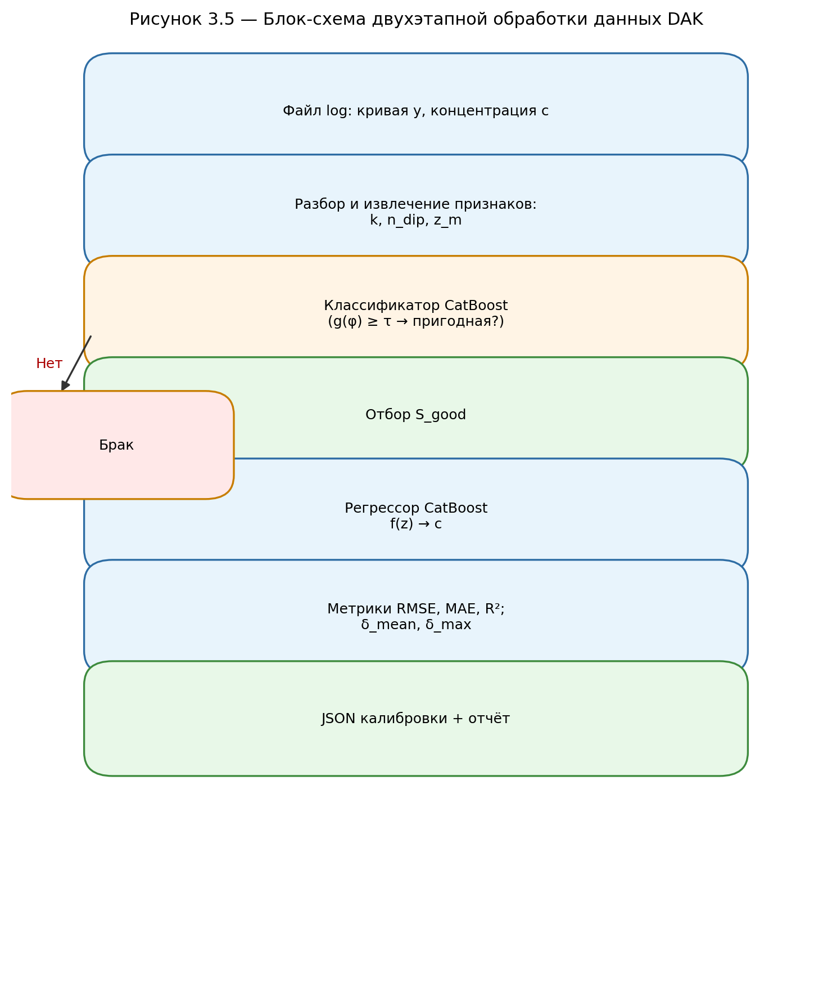
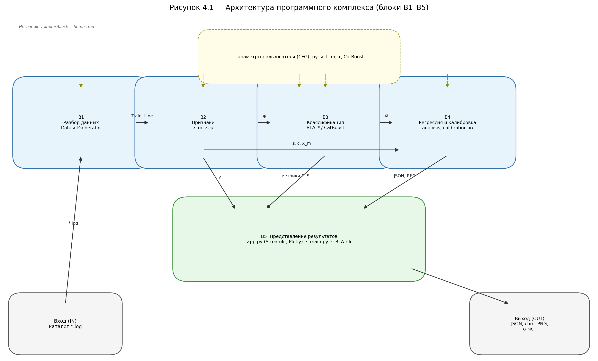
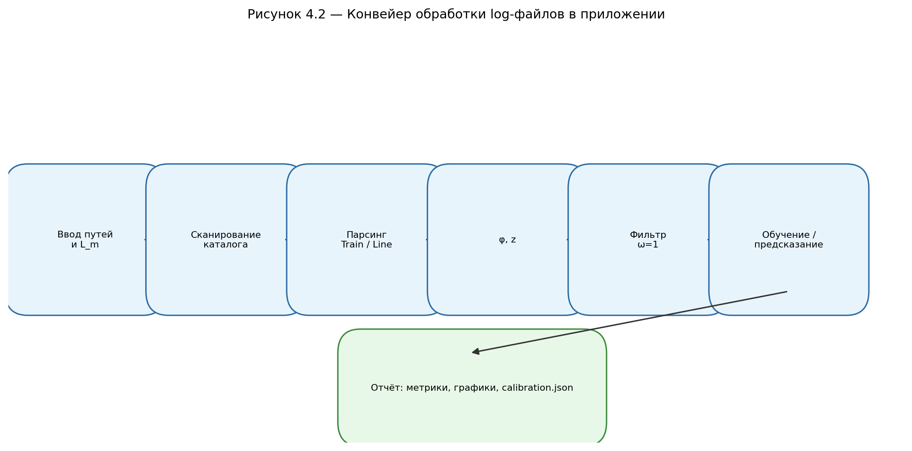

# Текст выпускной квалификационной работы

**Тема:** РАЗРАБОТКА АЛГОРИТМА МАШИННОГО ОБУЧЕНИЯ ДЛЯ ОПРЕДЕЛЕНИЯ КОНЦЕНТРАЦИИ СМАЗОЧНО-ОХЛАЖДАЮЩИХ ЖИДКОСТЕЙ ПО ДАННЫМ ДАТЧИКОВ DAK

*Наполнение разделов по SHABLON.docx и diplom.md. Без маркированных списков в тексте глав; таблицы результатов — в гл. 4 (по замечанию руководителя). Ссылки на источники — только в главах 1–4. Блок-схемы: `диплом/figures/`, пересборка — `python диплом/generate_figures.py`. Формулы — Microsoft Equation / MathType.*

---

## АННОТАЦИЯ

В рассматриваемой выпускной квалификационной работе на тему «Разработка алгоритма машинного обучения для определения концентрации смазочно-охлаждающих жидкостей по данным датчиков DAK» выполнено обоснование применения рефрактометрического канала, разработана математическая модель двухэтапной обработки цифровых кривых засветки и реализован программный комплекс на языке Python.

В работе приведены описание объекта измерения и классических методов калибровки, математическая постановка задач классификации качества кривых и регрессии концентрации, описание методов градиентного бустинга (CatBoost), описание компьютерной модели, а также результаты обучения и тестирования на измерительных логах DAK в виде графиков и численных сводок.

Выпускная квалификационная работа содержит ___ страниц, ___ рисунков, ___ формул, ___ источников.

**Ключевые слова:** смазочно-охлаждающая жидкость, рефрактометрия, датчик DAK, кривая засветки, машинное обучение, градиентный бустинг, CatBoost, калибровка.

---

## ANNOTATION

In this thesis on «Development of a machine learning algorithm for determining the concentration of metalworking fluids from DAK sensor data», the refractometric measurement channel is justified, a two-stage mathematical model of glare curves is developed, and a software package in Python is implemented.

The thesis describes the measurement object and classical calibration methods, mathematical formulations of curve-quality classification and concentration regression, gradient boosting (CatBoost), the computer model, and training and testing results on DAK measurement logs presented as charts and numerical summaries.

The thesis contains ___ pages, ___ figures, ___ equations, and ___ references.

**Keywords:** metalworking fluid, refractometry, DAK sensor, glare curve, machine learning, gradient boosting, CatBoost, calibration.

---

## СОДЕРЖАНИЕ

ВВЕДЕНИЕ

1 РЕФРАКТОМЕТРЫ И ИХ ПРИМЕНЕНИЕ  
1.1 Рефрактометры: история создания и назначение  
1.2 Принцип работы  
1.3 Рефрактометры в промышленности и металлообработке  
1.4 Цифровой датчик DAK и формат измерительных данных  
1.5 Постановка задачи  

2 МАШИННОЕ ОБУЧЕНИЕ  
2.1 Методы, которые используются в рефрактометрии  
2.2 Машинное обучение в рефрактометрии  

3 МАТЕМАТИЧЕСКАЯ МОДЕЛЬ  
3.1 Метод центра масс  
3.2 Метод перпендикуляров  
3.3 Постановка задачи классификации качества кривых  
3.4 Постановка задачи регрессии концентрации и калибровочная таблица  
3.5 Сравнение методов и обоснование выбранной схемы  

4 КОМПЬЮТЕРНАЯ МОДЕЛЬ (ПРОГРАММНАЯ РЕАЛИЗАЦИЯ)  
4.1 Архитектура программного комплекса  
4.2 Конвейер обработки данных и извлечения признаков  
4.3 Обучение классификатора качества кривых  
4.4 Обучение регрессионной модели концентрации  
4.5 Веб-интерфейс и визуализация  
4.6 Анализ результатов работы комплекса  

ЗАКЛЮЧЕНИЕ  
СПИСОК ИСПОЛЬЗУЕМЫХ ИСТОЧНИКОВ  
ПРИЛОЖЕНИЕ А  
ПРИЛОЖЕНИЕ Б  

---

## ВВЕДЕНИЕ

Контроль смазочно-охлаждающих жидкостей (СОЖ) на металлообрабатывающих предприятиях связан с режимом резания, износом инструмента и качеством поверхности детали. Встроенные рефрактометрические датчики DAK выдают не одно число, а цифровую кривую засветки — запись сеанса в файле log, которую можно накапливать и обрабатывать алгоритмами. Выпускная работа продолжает линию НИР, проектно-технологической, курсовой и преддипломной практик: формализует двухэтапный подход «сначала качество сигнала, затем концентрация и калибровка» и описывает программный комплекс от сырого лога до JSON-файла опорных точек для прошивки прибора.

Актуальность обусловлена ограничениями ручной калибровки и жёстких порогов в прошивке при загрязнении оптики и смене марки СОЖ. Накопленные логи позволяют строить модели на реальных измерениях, но только при отборе пригодных кривых до регрессии. Узкое место — подготовка опорных точек и согласование таблицы с эталонной сессией без просмотра сотен файлов вручную.

Цель работы — разработать алгоритм машинного обучения и программный комплекс автоматической калибровки датчика концентрации СОЖ по данным DAK. Для этого необходимо систематизировать сведения о рефрактометрии и классических методах обработки сигнала, формализовать математическую модель (гл. 3), построить классификатор качества кривых и регрессор концентрации, реализовать программу на Python с консольным и веб-интерфейсом и проанализировать метрики на отложенных данных.

---


## 1 РЕФРАКТОМЕТРЫ И ИХ ПРИМЕНЕНИЕ

Первая глава носит обзорный характер: в ней систематизированы физические основы рефрактометрии, эволюция приборов от лабораторных оптических схем до цифровых врезных датчиков, области применения с акцентом на контроль смазочно-охлаждающих жидкостей, а также особенности измерительного канала DAK и формата накопленных данных. Материал главы опирается на результаты научно-исследовательской, проектно-технологической и преддипломной практик и задаёт предметную рамку для математической модели (гл. 3) и программной реализации (гл. 4). Читатель, не знакомый с рефрактометрией, получает достаточный контекст; читатель, ориентированный на металлообработку, видит связь между цеховым контролем СОЖ и постановкой задачи калибровки по log-файлам.

### 1.1 Рефрактометры: история создания и назначение

Рефрактометр измеряет показатель преломления прозрачной или слабо рассеивающей среды либо величину, жёстко с ним связанную через калибровочную зависимость для конкретного класса растворов. Исторически измерение строилось на визировании границы светотени: в классическом рефрактометре Аббе оператор совмещал оптическую границу с сеткой окуляра и считывал положение перехода по шкале. Такой способ долго оставался эталоном в лабораториях пищевой, химической и фармацевтической отраслей, где требовалась прослеживаемость результата и сопоставимость с государственными эталонами состава.

Развитие оптики и приборостроения привело к появлению нескольких семейств устройств, различающихся по способу подачи света, геометрии призмы и способу считывания. Лабораторные рефрактометры с термостатируемой призмой обеспечивают наилучшую повторяемость, но привязаны к стационарному месту и процедуре подготовки пробы. Портативные цифровые приборы компенсируют это компактностью: измерение занимает секунды, результат выводится на дисплей в выбранных единицах — индексе преломления n_D, градусах Брикса для сахаросодержащих сред и т. п. Промышленные врезные рефрактометры устанавливаются непосредственно в трубопровод или байпас и выдают сигнал для системы управления; в современных версиях вместо одного порогового уровня используется линейка фотоприёмников, формирующая профиль интенсивности. Именно последний класс устройств наиболее близок к датчику DAK, рассматриваемому в данной работе.

С появлением полупроводниковых линеек и встраиваемой электроники измерение изменило не только точность, но и форму данных. Прибор перестал быть «щупом с одной цифрой» и стал источником цифрового следа — массива отсчётов вдоль координаты развёртки, пригодного для статистической обработки, архивирования и машинного обучения. Это совпадает с общей тенденцией аналитического приборостроения: первичный сигнал сохраняют, а скалярную оценку состава получают на этапе обработки, что упрощает диагностику сбоев и перенастройку калибровки без замены «железа».

Вместе с удобством сохраняются типичные трудности эксплуатации. Оптический канал со временем загрязняется, в пробе появляются пузырьки, меняется температура — форма кривой может изменяться быстрее, чем меняется химический смысл концентрации по старой таблице прошивки. В лаборатории эти эффекты частично снимают протоколом: очистка призмы, термостатирование, повторные измерения. В цехе же измерение должно оставаться быстрым, а отбраковка явно испорченных записей — формализованной, иначе в усреднение калибровки попадают выбросы. Поэтому для автоматической линии недостаточно повторить процедуру «увидеть границу и прочитать шкалу»; нужна обработка всего профиля и контроль качества каждой кривой перед включением её в расчёт опорных точек.

Исторически рефрактометрия в металлообработке долгое время оставалась вспомогательным методом рядом с титриметрией, измерением pH и визуальной оценкой состояния эмульсии. Переносной прибор давал быстрый ориентир мастеру смены, но не фиксировал форму сигнала и не накапливал историю для статистики. Появление ПЗС-линеек и записи сеанса в файл изменило постановку: инженер или исследователь получает не одно число, а объект для повторного анализа на компьютере. Выпускная работа опирается на этот переход: многоточечное описание фронта методом перпендикуляров и сравнение каждой кривой с опорной записью того же сеанса (математическая формулировка — в п. 3.2) восходят к той же идее сохранения полного профиля, а не только итогового показания на дисплее прибора.

### 1.2 Принцип работы

На границе двух прозрачных сред с показателями преломления n₁ и n₂ выполняется закон Снеллиуса [1]:

$$n_1 \sin\theta_1 = n_2 \sin\theta_2. \tag{1.1}$$

В жидкостных рефрактометрах, ориентированных на измерение в рабочей зоне, часто используют схему с полным внутренним отражением. Свет из оптически более плотной измерительной призмы падает на границу «призма — жидкость»; при углах, превышающих критический, луч полностью возвращается в призму. На линейке фотоприёмника формируется фронт засветки — резкий переход яркости. Положение и форма этого фронта связаны с показателем преломления исследуемой жидкости и, через эмпирическую калибровку прибора, с концентрацией.

Теоретически яркость засветки как функция угла падения может быть записана через коэффициенты Френеля на границе раздела и учёт поляризации падающего пучка [1]. Для границы «призма — жидкость» отражение зависит от показателя преломления жидкости; при переходе через критический угол наблюдается резкая смена режима отражения, что и проявляется на линейке как фронт. Полный расчёт с учётом спектра источника, шероховатости границы и неоднородности эмульсии быстро выходит за рамки оперативной калибровки в цехе. Поэтому прямое «обращение» оптической модели для вычисления концентрации в серийном приборе затруднено, и производители опираются на эмпирические таблицы и опорные растворы. Реальный сигнал чувствителен к вибрации, температурным колебаниям и микрозагрязнениям оптики; геометрические параметры тракта (взаимное положение источника, призмы и линейки) в серийном производстве имеют разброс допусков. Поэтому на практике опираются на эмпирическую методику: при изменении концентрации фронт засветки в рабочем диапазоне смещается почти линейно, и эту закономерность используют для калибровки.

Цифровой сигнал датчика DAK — дискретная кривая

$$\mathbf{y} = (y_0, y_1, \ldots, y_{N-1})^{\mathsf{T}}, \quad y_j \geq 0, \tag{1.2}$$

где N определяется числом элементов ПЗС-линейки. Каждый отсчёт y_j соответствует усреднённой по пикселю интенсивности за короткую экспозицию. В записи сеанса, помимо массива y, хранятся концентрация c (если известна), идентификатор пробы и при необходимости температура.

Для перехода от «сырой» кривой к компактному, но информативному описанию на крутом участке фронта проводят несколько горизонтальных линий постоянной яркости и фиксируют координаты их пересечений с профилем. Такой приём соответствует методу перпендикуляров; обозначения уровней и координат пересечений вводятся в п. 3.2. Уровни должны лежать там, где смещение фронта при изменении концентрации близко к линейному, но быть достаточно высокими, чтобы шум не давал ложных пересечений. На рисунке 1.3 (в материалах практики) наглядно видно, как фронт смещается при изменении концентрации — именно эта геометрия ложится в основу признаков для моделей главы 3.

Показатель преломления жидкости зависит от температуры; для водных растворов известны табличные поправки [2]. В лабораторных работах калибровку нередко нормируют к 20 °C, выдерживая пробу в термостате. В цеховых условиях температура СОЖ в бачке может отличаться от комнатной, а датчик измеряет непосредственно в потоке. Если температуру не фиксировать в записи сеанса, часть разброса между кривыми одной и той же концентрации объясняется термическим дрейфом, а не ошибкой модели. В программном комплексе поле температуры в log-файле предусмотрено парсером; в основных экспериментах выпускной работы акцент сделан на форме фронта и на сравнении кривых внутри одной калибровочной серии с опорной записью сеанса (п. 3.2–3.3).

По назначению рефрактометры условно делят на лабораторные, полевые (портативные) и промышленные (потоковые). Лабораторный прибор задаёт эталон повторяемости при соблюдении методики, но не рассчитан на непрерывный мониторинг бачка СОЖ. Портативный цифровой рефрактометр закрывает задачу выборочного контроля: мастер смены берёт пробу, наносит каплю на призму, фиксирует концентрацию в журнале. Потоковый или врезной датчик измеряет состав непосредственно в линии подачи или в ответвлении от бачка, что важно при больших объёмах циркуляции и при необходимости раннего обнаружения разбавления системы. DAK в рамках данной работы относится к последней группе по месту установки, но дополнительно сохраняет полный цифровой профиль засветки, что ближе к исследовательскому протоколу, чем к одноканальному дисплею.

Шкалы отображения результата выбирают исходя из химии раствора. Для сахаросодержащих сред исторически закрепились градусы Брикса; для универсальных задач — показатель преломления. В металлообработке эмульсии и растворы СОЖ не всегда имеют прямую аналогию с таблицами Брикса, поэтому на практике строят собственную калибровку «показание прибора (или координата фронта) — концентрация в процентах» для конкретной марки жидкости. Такая калибровка может храниться в прошивке в виде таблицы опорных точек по нескольким уровням яркости на линейке — именно этот формат поддерживает программный комплекс выпускной работы при выгрузке JSON.

К основным источникам погрешности относят температурный дрейф показателя преломления [2], наличие пузырьков воздуха в тонком слое жидкости на призме, загрязнение оптики, неоднородность эмульсии (включения масла, стружки, бактериального шлама), а также механические вибрации и изменение яркости источника. Часть из них проявляется как смещение всего профиля без изменения формы склона, другая — как локальные искажения фронта («рваный» сигнал, двойной фронт). Разделение этих случаев на этапе обработки важно: для калибровки концентрации нужны кривые с узнаваемым склоном, а не только записи с «средним» уровнем сигнала в норме.

**Рисунок 1.1** — Схематическое изображение рефрактометра (призма, образец, линейка).  
*[Вставить рисунок из НИР/ИР.]*

**Рисунок 1.2** — Графики засветки для разных концентраций.  
*[Вставить расчётные или реальные кривые.]*

**Рисунок 1.3** — Увеличенный фронт графиков засветки.  
*[Вставить фрагмент склона с горизонтальными уровнями яркости.]*

### 1.3 Рефрактометры в промышленности и металлообработке

Рефрактометры находят широкое и для ряда технологий критически важное применение в металлообрабатывающей промышленности, в первую очередь при контроле концентрации смазочно-охлаждающих жидкостей (СОЖ). СОЖ участвуют в точении, фрезеровании, сверлении, шлифовании и других операциях, где необходимо снижать трение, отводить тепло и удалять стружку из зоны резания. От правильной концентрации и состояния жидкости напрямую зависят ресурс инструмента, качество поверхности детали и экономичность процесса в целом [7].

В рабочей зоне резания СОЖ одновременно охлаждают узел «инструмент — заготовка», снижая риск перегрева и термических деформаций, и выполняют смазочную функцию, уменьшая износ режущей кромки. Поток жидкости выносит стружку, не давая ей повторно измельчаться и засорять обработку. Для оборудования и деталей важна и антикоррозионная составляющая эмульсии или раствора, особенно при долгих циклах работы и простоях линии. Все перечисленные эффекты проявляются только при устойчивом составе в бачке, а на практике его главным оперативным индикатором для водных систем остаётся концентрация.

Концентрация СОЖ в водной эмульсии относится к числу наиболее чувствительных параметров. При её занижении возрастает износ инструмента и вероятность его преждевременного выхода из строя, усиливается нагрев заготовки, ухудшается качество поверхности и повышается риск коррозии. При завышенной концентрации растёт расход дорогостоящего концентрата, нередко усиливается пенообразование, возможны дерматологические ограничения для персонала при контакте с раствором, а моющие свойства жидкости в отдельных рецептурах могут снижаться. Поддержание целевого диапазона — это не разовая лабораторная процедура, а регулярная дисциплина цеха, особенно после доливки воды, концентрата или смены марки СОЖ.

Именно здесь рефрактометр становится рабочим инструментом метрологического контроля. Показатель преломления прозрачной или слабо мутной пробы в типичной постановке жёстко связан с содержанием растворённых компонентов, поэтому прибор даёт быструю косвенную оценку концентрации без химического анализа всей бачковой массы. Ручной или портативный цифровой рефрактометр позволяет оператору на месте нанести несколько капель эмульсии на призму и получить число за секунды. Регулярные измерения помогают не допускать ни хронического «разбавления» системы, ни избыточной дозировки концентрата, что в сумме снижает эксплуатационные потери. Стабильная концентрация поддерживает эффективное смазывание и охлаждение, продлевает ресурс инструмента и делает результат обработки более предсказуемым. Тот же принцип переносится на другие технологические жидкости цеха — растворы для промывки, антикоррозионные составы, среды закалки — где также важна доля активного вещества в водной фазе.

Наряду с металлообработкой рефрактометрия давно закрепилась в пищевой промышленности (контроль сахарозы, шкала Брикса), в нефтехимии и на потоковых линиях, где пробу в пробирку отобрать нельзя. В химическом и фармацевтическом производстве измерения входят в контур аналитических технологий PAT: сигнал подаётся не только оператору, но и системам мониторинга процесса [3]. В напитках и сенсорных установках рефрактометрию нередко комбинируют с другими датчиками и статистическими моделями состава [4, 5, 6]. Для встроенного датчика DAK важен общий вывод смежных отраслей: по мере перехода от одного числа к полному цифровому профилю засветки возрастает информативность, но вместе с ней — необходимость формализованного контроля качества каждой записи перед калибровкой.

В металлообработке традиционная схема с ручным отбором пробы, нанесением на призму и фиксацией результата в журнале по-прежнему распространена, однако она плохо масштабируется при росте парка станков и накоплении измерений. Оператор вынужден субъективно отбраковывать «подозрительные» показания и кривые: двойной фронт, пузырьки в пробе, смещение всего сигнала при загрязнении оптики. Встроенные рефрактометрические каналы, в том числе DAK, снимают цифровую кривую засветки и сохраняют сеанс в log-файле — это создаёт основу для автоматизации мониторинга и калибровки. Данные о концентрации можно согласовывать с опорными сериями, отбирать пригодные записи алгоритмом, формировать калибровочную таблицу для прошивки и в перспективе передавать результаты в систему управления производством, снижая долю ручного труда и повышая воспроизводимость контроля.

Цифровой датчик DAK занимает промежуточное положение между «полевым» цеховым прибором и лабораторным эталоном: измерение выполняется в реальных условиях эксплуатации, но отчёт должен быть таким же проверяемым, как в PAT-системах [3]. Программный комплекс калибровки по накопленным log-файлам призван выдавать не только оценку концентрации, но и явный признак пригодности входной кривой, согласовывать усреднённую таблицу с эталонной сессией и документировать метрики на отложенных данных. При смене марки СОЖ или после ремонта оптики разумно собирать новую серию измерений и проходить полный цикл обучения и выгрузки JSON, а не «дотягивать» старую калибровку. Переход от одного числа на дисплее к анализу полного профиля засветки в данной работе рассматривается как естественный шаг при появлении ПЗС-линеек и архивов log; далее эти требования формализуются в постановке задачи.

### 1.4 Цифровой датчик DAK и формат измерительных данных

Под датчиком DAK в контексте выпускной работы понимается рефрактометрический канал, встроенный в контур контроля СОЖ и выдающий цифровую кривую засветки вместе с сопутствующими метаданными сеанса. С точки зрения пользователя прибор решает ту же задачу, что и портативный рефрактометр, — оценку концентрации в процентах, — но для разработчика алгоритма калибровки первичным объектом становится не одно число на дисплее, а файл измерений, пригодный для пакетной обработки на компьютере. Такой сдвиг парадигмы позволяет накапливать корпус записей за смену или за сезон, обучать модели на реальных условиях цеха и воспроизводимо формировать таблицу опорных точек для прошивки.

Измерительные записи хранятся в текстовых файлах с расширением log. Структура файла сложилась под потоковую запись с прибора: служебные строки несут идентификатор пробы, при необходимости температуру и концентрацию c, если она известна оператору или системе учёта; числовые строки содержат отсчёты интенсивности засветки, разбитые на фрагменты фиксированной длины (в архивных экспортах проекта встречается, например, шестнадцать значений в строке). Пустая строка служит разделителем и означает завершение одной кривой — одного измерения на линейке. Парсер построчно накапливает массив y и при встрече разделителя формирует внутренний объект «кривая» с меткой концентрации. Кривые с неполными или некорректно разобранными служебными полями отбрасываются на стадии загрузки, чтобы не искажать обучение.

Логически один log-файл соответствует измерительной сессии: последовательности кривых, снятых в одних условиях (один бачок, одна серия калибровки, один протокол отбора). Для каждой сессии первая валидная запись автоматически назначается опорной кривой y⁽⁰⁾; относительно неё на крутом участке фронта вычисляют смещения пересечений с горизонтальными уровнями яркости L_m (подробно — в п. 3.2). Выбор опорной кривой внутри файла, а не из внешнего эталона на каждом шаге, отражает цеховую практику: в рамках одной серии измерений важна стабильность условий съёма, а сравнение «текущая — опорная» частично компенсирует дрейф оптики и небольшие изменения яркости источника.

В программном комплексе используются несколько типов каталогов данных. Каталог обучающих log-файлов (в экспериментах — trains/) содержит серии с известными или помеченными концентрациями для построения регрессии и усреднения калибровочной таблицы. Эталонный файл (например, dak/train.log) задаёт сессию, с которой сравнивают усреднённый корпус при проверке расхождений x̄_m и x̂_m. Отдельный history_log имитирует приход новой партии измерений без переобучения модели. Для контура классификации качества кривых подготовлены каталоги good и bad (пакет BLA_test_pack), куда записи попадают по правилу разметки по резкости фронта k и числу локальных провалов n_dip, согласованному с п. 3.3. Накопление таких архивов — необходимое условие воспроизводимости результатов главы 4: метрики на hold-out и на внешнем тест-паке имеют смысл только при фиксированном протоколе подготовки данных.

Связь первой главы с последующими разделами работы можно резюмировать так. Пункты 1.1–1.2 задают физику и вид сигнала; п. 1.3 — технологический контекст металлообработки; п. 1.4 — конкретный объект исследования (log, сессия, опорная кривая, корпуса данных). На этой основе в главе 3 вводятся признаки и двухэтапная схема «качество кривой — концентрация — JSON», а в главе 4 описывается реализация на Python. Без понимания формата DAK постановка задачи машинного обучения выглядит оторванной от прибора; обзорная первая глава как раз устраняет этот разрыв.

### 1.5 Постановка задачи

В предметной области DAK можно выделить три взаимосвязанные трудности. Первая — сведение всей кривой к одному скалярному параметру без учёта формы фронта: при равномерном сдвиге профиля из-за запыления окна или изменения яркости источника одна контрольная точка даёт систематическую ошибку, хотя визуально кривая остаётся узнаваемой. Вторая — ручной отбор пригодных измерений при росте числа сеансов. Третья — отсутствие единого программного контура от файла log до готовой калибровки с отчётом о качестве.

Задача выпускной работы — разработать двухэтапный алгоритм и программную реализацию. На первом этапе выполняется бинарная классификация качества кривой: пригодна ли запись для дальнейшей калибровки. На втором — регрессия концентрации по признакам формы фронта и формирование калибровочной таблицы для встроенного ПО. Математические определения признаков, меток и метрик согласования с эталоном даны в главе 3.

Объект исследования — цифровые записи рефрактометрического канала DAK. Предмет исследования — методы и программные средства машинного обучения для калибровки датчика концентрации СОЖ.

Гипотеза работы состоит в том, что двухэтапная схема «сначала отбор по качеству сигнала, затем регрессия концентрации» даёт более устойчивую калибровку, чем прямая регрессия по всем кривым без отбора или, наоборот, только жёсткие пороговые правила без обучаемой границы. Проверка гипотезы строится на сравнении метрик регрессии на корпусе до и после фильтрации, на качестве классификатора на внешнем тестовом паке и на показателях расхождения усреднённой калибровки с эталонной сессией (см. п. 3.4). Отрицательный результат (например, падение R² после фильтрации при слишком жёстком пороге отсечения) также информативен: он указывает на нехватку данных или на неверный выбор опорной кривой, а не на «плохой» алгоритм бустинга как таковой.

---

## 2 МАШИННОЕ ОБУЧЕНИЕ

Вторая глава связывает обзор рефрактометрии из главы 1 с математической и программной частями работы. Сначала систематизированы классические детерминированные методы обработки кривой засветки, которые исторически применялись при калибровке и до сих пор заложены в прошивки и регламенты цеха. Затем показано, как аналогичные задачи решаются в смежных отраслях с помощью машинного обучения, и обоснован выбор градиентного бустинга в реализации CatBoost для датчика DAK. Читатель видит, что алгоритмы главы 3–4 не заменяют физику прибора, а дополняют её там, где ручные правила и одномерные дескрипторы перестают масштабироваться на поток log-файлов.

Машинное обучение — область, в которой зависимость между признаками объекта и целевой переменной выводится из размеченных примеров, а не кодируется вручную длинной цепочкой правил [8, 9]. В прикладной постановке это означает: по множеству пар «описание кривой — метка качества» или «описание кривой — концентрация» строится модель, которая на новых кривых выдаёт предсказание.

Помимо обучения с учителем в учебниках выделяют обучение без учителя и с подкреплением. В данной работе используется только обучение с учителем, потому что и фильтрация кривых, и оценка концентрации предполагают известные метки на этапе обучения. Качество оценивают на отложенной выборке, не участвовавшей в подборе параметров модели. Для классификации важны точность, полнота, F₁-мера и площадь под ROC-кривой; для регрессии — среднеквадратичная и средняя абсолютная ошибки, коэффициент детерминации R² [8, 9].

Ансамблевые методы объединяют несколько базовых моделей. Бэггинг (типичный пример — случайный лес [10]) обучает деревья на разных bootstrap-подвыборках и усредняет ответы, снижая дисперсию. Бустинг строит модели последовательно: каждая следующая исправляет ошибки предыдущих. Градиентный бустинг формализует это как градиентный спуск в пространстве функций: на очередной итерации добавляется дерево, обученное предсказывать антиградиент функции потерь [11]. Ниже сначала рассмотрены подходы, традиционно применяемые в рефрактометрии без машинного обучения, затем — обоснование выбора CatBoost для DAK.

В контексте данной работы обучение с учителем означает, что для каждой кривой известна метка: либо принадлежность к классу «пригодная / непригодная», либо концентрация c (если она зафиксирована в log-файле). Модель не «изобретает» физику преломления, а аппроксимирует эмпирическую зависимость между компактным вектором признаков и меткой на представительном корпусе. Переобучение контролируется разбиением на обучающую и отложенную части, фиксацией случайного seed и проверкой на независимой серии, не входившей ни в одну стадию подбора гиперпараметров. Такой протокол ближе к инженерной валидации прибора, чем к чисто соревновательному машинному обучению: важна не только высокая точность на архиве, но и устойчивость на новом log-файле при том же протоколе выбора опорной кривой сеанса (п. 3.2).

*(При вёрстке в Word: разрыв страницы перед п. 2.1.)*

### 2.1 Методы, которые используются в рефрактометрии

Под «методами в рефрактометрии» понимаются детерминированные процедуры, которые применяют до внедрения обучаемой модели или вместо неё.

Визуальное считывание или автоматическое определение одной координаты границы «свет — тень» остаётся базовым вариантом. Подход прозрачен физически и легко объясняется оператору, но при равномерном сдвиге всего профиля одна точка ошибается, хотя форма фронта может остаться узнаваемой по нескольким уровням.

Метод центра масс (подробнее в п. 3.1, в том числе патентные решения [12]) вычисляет взвешенное среднее положения склона по всем отсчётам. Это снижает чувствительность к локальному шуму по сравнению с одной пороговой точкой, но не различает асимметрию фронта, локальные провалы и двойной фронт — типичные признаки загрязнённой оптики или пузырьков в пробе.

Метод перпендикуляров строит несколько горизонтальных уровней яркости на склоне фронта и фиксирует координаты их пересечений с профилем (формулы и обозначения — в п. 3.2). Это ближе к заводской калибровке и даёт многомерное описание фронта, однако в классическом виде сводится к интерполяции «параметр — концентрация» без автоматического отбора бракованных записей; отбор кривых остаётся на операторе.

Между перечисленными классическими приёмами существует иерархия информативности. Одна координата границы даёт минимум данных о форме; центр масс добавляет устойчивость к локальному шуму, но сжимает профиль в одно число; набор пересечений с уровнями L_m сохраняет геометрию склона в компактном векторе фиксированной размерности M. Именно поэтому в дальнейшем за основу признаков для регрессии и для JSON калибровки принят метод перпендикуляров, а не x_cm alone.

Лабораторная калибровка по серии из шестнадцати–двадцати опорных растворов (часто сахароза в дистиллированной воде при 20 °C) метрологически обоснована. Каждый раствор выдерживают до теплового равновесия, наносят на очищенную призму, записывают кривую и извлекают параметры. Пары «параметр — концентрация» образуют калибровочный график (рис. 1.4 в материалах практики). Процедура прозрачна, но длительна, плохо переносится на другой состав СОЖ без новой серии и не масштабируется при сотнях файлов log.

В материалах научно-исследовательской практики подробно разобрана последовательность такой калибровки: приготовление растворов с известной массовой долей, контроль температуры, очистка оптической призмы, ожидание стабилизации показаний, фиксация координаты границы или нескольких пересечений с уровнями. Полученная зависимость носит монотонный характер в рабочем диапазоне и служит эталоном для сравнения с цифровой обработкой. Однако перенос той же схемы «в лоб» на водную эмульсию СОЖ ограничен: состав сложнее сахарозы, проба может быть мутной, а условия отбора в цехе менее стабильны, чем в лаборатории. Поэтому в выпускной работе лабораторная калибровка рассматривается как нормативный ориентир, а рабочий контур — как обработка реальных log-файлов DAK с последующей выгрузкой таблицы в формате прошивки.

Жёсткие пороговые правила на отсчётах (например, ограничение резкости фронта и допустимого числа локальных провалов на склоне — см. п. 3.3) внедряются быстро, однако жёстко привязаны к конкретному корпусу и требуют ручной перенастройки при смене условий.

Цифровая обработка сигналов — сглаживание, поиск локальных экстремумов [13] — уменьшает шум, но сама по себе не связывает профиль с концентрацией без отдельного калибровочного слоя.

Метод наименьших квадратов для аппроксимации калибровочного графика «параметр — концентрация» остаётся стандартом в метрологии. Если же в качестве параметра взять только центр масс x_cm (п. 3.1) или одну координату пересечения с уровнем, остатки по концентрации на реальных логах DAK часто оказываются несимметричными: в одной области шкалы ошибка завышения, в другой — занижения. Многомерное описание фронта методом перпендикуляров и нелинейная регрессия по вектору относительных признаков (п. 3.2–3.4) снимают часть этой систематики без отказа от физически осмысленных уровней яркости. При этом интерпретация для инженера сохраняется: важности признаков CatBoost показывают, какие уровни или их комбинации доминируют в ошибке, а тепловая карта указывает конкретную пару «концентрация — уровень».

Сопоставление этих подходов показывает, что классика остаётся физическим и нормативным ориентиром, тогда как для потока логов DAK целесообразна комбинация перпендикуляров как источника признаков и машинного обучения для отбора качества и регрессии концентрации.

При проектировании цифрового конвейера для DAK полезно явно разделить роли: сглаживание и поиск особенностей профиля относятся к подготовке сигнала; извлечение x_m и z_m — к формированию признаков по п. 3.2; пороги по k и n_dip могут служить быстрой разметкой или предфильтром, но не обязаны быть единственной границей качества; обучаемая модель фиксирует нелинейные комбинации признаков на представительном корпусе. Такое разделение и легло в основу двухэтапной архитектуры «классификация, затем регрессия», подробно формализованной в главе 3 и реализованной в главе 4.

*(При вёрстке в Word: разрыв страницы перед п. 2.2.)*

### 2.2 Машинное обучение в рефрактометрии

В работе Martinez-Manuel и соавт. [5] для волоконного рефрактометра показано, что многоканальный сигнал и модель машинного обучения снимают неоднозначность показаний и повышают устойчивость оценки показателя преломления. Центральная идея близка к DAK: если прибор даёт не один скаляр, а целый профиль, многомерное описание и статистическая модель могут быть точнее однопороговой схемы.

Aalizadeh и соавт. [6] повышают точность, обучая модель на полном спектре отклика, а не на одной длине волны. Для практики DAK это означает: использовать весь доступный цифровой след — совокупность пересечений профиля с несколькими уровнями яркости, а не одну точку на линейке.

Williams и соавт. [3] интегрируют inline-рефрактометрию в контур PAT биопроизводства; качество сырого сигнала критично для доверия к прогнозам. Любой незамеченный артефакт измерения превращается в ошибку управления процессом. Отсюда прямо следует необходимость классификатора пригодности кривых в нашей работе.

Plugatar и соавт. [4] комбинируют рефрактометрию с другими измерениями и машинным обучением для оценки состава; авторы подчёркивают важность предварительной фильтрации выбросов — та же логика, что и двухэтапная схема «сначала качество, затем регрессия» в настоящей ВКР.

Для профиля засветки DAK естественна постановка с табличными признаками, которые формализуются в главе 3: координаты пересечений с уровнями, их относительные смещения относительно опорной кривой, резкость фронта и число локальных провалов. В качестве кандидатов рассматривались логистическая регрессия и метод k ближайших соседей как быстрые базовые модели, случайный лес [10], XGBoost и LightGBM [14, 15], CatBoost [16, 17]. Логистическая регрессия на двух скалярных признаках качества даёт интерпретируемую границу, но плохо описывает нелинейные случаи, когда размытый фронт сочетается с умеренным числом провалов из-за локального загрязнения. Метод k ближайших соседей чувствителен к масштабу признаков и к плотности разметки в углах распределения. Для выпускной работы выбраны CatBoostClassifier на этапе фильтрации и CatBoostRegressor на этапе концентрации как компромисс между качеством, устойчивостью на малых выборках и удобством внедрения.

Выбор CatBoost обоснован несколькими практическими соображениями. Пропуски в компонентах вектора признаков, когда кривая не пересекает заданный уровень яркости, обрабатываются встроенными механизмами без отдельного заполнения пропусков. Ordered Boosting уменьшает смещение предсказаний на малых и средних выборках, характерных для калибровочных серий [16]. Симметричные деревья (Oblivious Trees) ускоряют предсказание и ограничивают сложность модели. Значения гиперпараметров по умолчанию часто дают приемлемое качество без длительного перебора — важно для инженерного внедрения. При дисбалансе «хороших» и «плохих» линий используется встроенная балансировка классов.

Композиция регрессора в градиентном бустинге — сумма T решающих деревьев, каждое из которых уточняет предсказание на предыдущих итерациях; для концентрации СОЖ в качестве входа выступает вектор признаков, формируемый по п. 3.2–3.3 (запись через сумму деревьев — в п. 3.4).

Для регрессии с квадратичной потерью эмпирический риск на обучающей выборке минимизирует средний квадрат ошибки. Для бинарной классификации минимизируют кросс-энтропию; на контроле смотрят accuracy, precision, recall, F₁ и ROC-AUC.

При нехватке размеченных «плохих» кривых теоретически применимы методы обнаружения аномалий (Isolation Forest [18]); в реализованном комплексе основной путь — явная классификация с полуавтоматической разметкой по каталогам good и bad.

С точки зрения теории градиентного бустинга [11] на каждой итерации t минимизируется приближение к антиградиенту функции потерь. В CatBoost дополнительно применяется Ordered Boosting: для каждого объекта обучения используется только подвыборка с меньшим индексом, что снижает смещение оценки градиента на малых выборках — типичных для калибровочных серий из десятков–сотен кривых [16]. Деревья в CatBoost часто строятся как oblivious (симметричные): на одном уровне все листья разделяются по одному и тому же признаку и порогу, что упрощает структуру и ускоряет предсказание на встроенном устройстве. Для регрессии концентрации в реализации задана функция потерь RMSE; для классификации — Logloss с выдачей вероятности класса «хорошая кривая».

Сравнение с XGBoost и LightGBM [14, 15] в прикладном смысле сводится к удобству работы с пропусками в табличных признаках без отдельного заполнения, к устойчивости на небольших выборках и к меньшему числу ручных настроек при первом внедрении. Случайный лес [10] даёт конкурентное качество на многих задачах, но в данной предметной области важна интерпретируемость порядка важности признаков и возможность дообучения на новых логах с сохранением формата cbm — это также поддерживается CatBoost.

Для инженера, внедряющего комплекс на производстве, машинное обучение в данной работе — не «чёрный ящик», а воспроизводимая процедура с фиксированным seed, отложенной выборкой и внешним тест-паком. Классификатор отвечает на вопрос «можно ли доверять этой кривой при калибровке», регрессор — «какая концентрация соответствует форме фронта относительно опорной», а модуль calibration_io — «совпадает ли усреднённая таблица с эталонным train.log». Такая декомпозиция совпадает с логикой обслуживания прибора в цехе и подготавливает переход к формальным формулам главы 3.

*(При вёрстке в Word: разрыв страницы перед главой 3.)*

---

## 3 МАТЕМАТИЧЕСКАЯ МОДЕЛЬ

Для решения задачи калибровки датчика DAK по цифровым кривым засветки в теории и на практике доступен целый набор подходов. Классические варианты сводят профиль к одному скалярному параметру: координате границы «свет — тень», центру масс склона (п. 3.1) или набору пересечений с горизонтальными уровнями яркости — методу перпендикуляров (п. 3.2). Параллельно применяют жёсткие пороговые правила по резкости фронта и числу локальных провалов, а также регрессию «параметр — концентрация» по лабораторной серии опорных растворов. В последние годы для многоканальных и спектральных рефрактометров активно используют машинное обучение: модель обучается на представительном корпусе измерений и обобщает зависимость между признаками и целевой величиной [5, 6].

Ни один из перечисленных методов в чистом виде не закрывает все ограничения DAK одновременно. Одноточечная схема чувствительна к равномерному сдвигу профиля при загрязнении окна. Центр масс сглаживает шум, но не различает двойной фронт и локальные «ямы» на склоне. Перпендикуляры дают информативный вектор признаков, однако без этапа отбора бракованных записей регрессия по концентрации зашумляется. Жёсткие пороги k и n_dip быстро внедряются, но требуют ручной перенастройки при смене условий. Прямая регрессия концентрации по всем кривым корпуса без фильтрации смешивает пригодные и дефектные сеансы. Поэтому в настоящей работе рассматриваются перечисленные методы подробнее, сопоставляются их достоинства и ограничения, после чего обосновывается комбинированная схема: многоточечные признаки z_m по п. 3.2, бинарная классификация качества по п. 3.3 и нелинейная регрессия концентрации с выгрузкой калибровочной таблицы по п. 3.4. Итоговое сравнение и выбор фиксируются в п. 3.5.

В данной главе объединён математический аппарат из научно-исследовательской, проектно-технологической и преддипломной практик и курсовой работы. Общие сведения о градиентном бустинге приведены в главе 2; здесь последовательно вводятся обозначения, формулы и связь с программной реализацией. Вектор отсчётов **y** и концентрация **c** уже заданы в п. 1.2 формулой (1.2); структура log-файла, сессия и опорная кривая y⁽⁰⁾ — в п. 1.4. В п. 3.1 вводится одномерный дескриптор x_cm. В п. 3.2 определяются уровни яркости L_m, координаты пересечений x_m, опорная кривая сеанса и относительные признаки z_m. В п. 3.3 — признаки и метки задачи классификации качества кривой. В п. 3.4 — постановка регрессии концентрации и метрики согласования калибровочной таблицы с эталоном. В п. 3.5 — сравнение методов и итоговый выбор двухэтапной схемы. В главе 4 и в заключении используются только обозначения, введённые в пп. 3.1–3.5.

Глава построена так, чтобы каждый последующий раздел опирался на предыдущий: сначала фиксируются альтернативные одномерные и многомерные описания фронта без машинного обучения, затем отдельно формализуется задача отбора бракованных записей, затем — восстановление концентрации и согласование таблицы с эталоном. Такой порядок соответствует реальному конвейеру обработки log-файла и упрощает чтение программного кода в главе 4.

*(При вёрстке в Word: разрыв страницы перед п. 3.1.)*

### 3.1 Метод центра масс

Центр масс одномерного профиля интенсивности:

$$x_{\mathrm{cm}} = \frac{\sum_{j=0}^{N-1} j \cdot y_j}{\sum_{j=0}^{N-1} y_j}, \tag{3.1}$$

где j — индекс (координата) отсчёта на линейке;

y_j — значение интенсивности в j-м пикселе;

N — число отсчётов кривой.

Метод даёт «взвешенное среднее» положения склона: в сумму входят все пиксели с ненулевым вкладом, а не только ближайшие к одному порогу. Поэтому локальный шум слабее влияет на x_cm, чем на одну точку пересечения. Платой служит потеря информации о форме: центр масс не отражает асимметрию, локальные провалы и «ступеньки» на склоне — как раз те особенности, по которым оператор на графике отбраковывает запись.

В выпускной работе x_cm рассматривается как исторически значимый одномерный дескриптор и точка сравнения с многоточечной схемой перпендикуляров (п. 3.2). Признаки для задач классификации и регрессии вводятся ниже в п. 3.2–3.3.

В программной реализации для Line дополнительно вычисляется взвешенный центр на окне вокруг пикселя с максимальным наклоном (acs_px): берётся несколько соседних приращений, и по модулю наклона строится локальное «центроидное» положение фронта. Этот признак близок по духу к формуле (3.1), но ограничен окном вокруг крутого участка, а не всей линейкой.

**Рисунок 3.1** — Увеличенный фронт графиков засветки (пояснение к выбору уровней L_m).  
*[Вставить фрагмент кривой.]*

В типичных логах DAK центр масс коррелирует с концентрацией в среднем, но отдельные выбросы с «двойным» фронтом или глубокими провалами смещают x_cm слабо предсказуемо. Поэтому в выпускной работе x_cm не используется как единственный вход регрессора, однако остаётся важным ориентиром при сопоставлении с патентной и заводской терминологией [12] и при объяснении оператору, почему перешли к многоточечной схеме.

*(При вёрстке в Word: разрыв страницы перед п. 3.2.)*

### 3.2 Метод перпендикуляров

Метод перпендикуляров (в терминах цифровой обработки — пересечение профиля засветки с горизонтальными уровнями постоянной яркости) даёт компактное многомерное описание фронта. Задаётся упорядоченный набор уровней L_1, …, L_M на склоне фронта, где зависимость координаты пересечения от концентрации в рабочем диапазоне близка к линейной. Уровни фиксированы для всех кривых одной конфигурации прибора; индекс m пробегает значения от 1 до M.

Для кривой y и уровня L_m, если y_j ≤ L_m ≤ y_{j+1} и y_{j+1} ≠ y_j, координата пересечения находится линейной интерполяцией:

$$x_m(\mathbf{y}) = j + \frac{L_m - y_j}{y_{j+1} - y_j}. \tag{3.2}$$

где x_m — координата пересечения (дробный индекс пикселя);

L_m — m-й горизонтальный уровень сигнала;

j — индекс пары соседних отсчётов.

Если пересечение отсутствует (кривая не достигает уровня или весь профиль ниже), x_m помечается как пропуск. Библиотека CatBoost корректно обучается при наличии пропусков в числовых признаках.

Опорная кривая сеанса y⁽⁰⁾ — первая валидная запись эталонного файла. Для любой другой кривой y той же сессии вводятся относительные признаки:

$$z_m = x_m^{(0)} - x_m, \quad m = 1,\ldots,M. \tag{3.3}$$

где x_m⁽⁰⁾ — пересечение опорной кривой с тем же уровнем L_m.

Вектор признаков для регрессии концентрации:

$$\mathbf{z} = (z_1, z_2, \ldots, z_M)^{\mathsf{T}}. \tag{3.3a}$$

Использование разностей, а не абсолютных координат, частично компенсирует систематический сдвиг профиля при дрейфе оптики или небольших отличиях в юстировке между сеансами. Признаковое описание становится более инвариантным к условиям съёма.

Для калибровочной таблицы, загружаемой во встроенное ПО датчика, по каждой концентрации c из заданного списка усредняют абсолютные координаты по всем пригодным записям корпуса:

$$\bar{x}_m(c) = \frac{1}{|K_c|}\sum_{k \in K_c} x_m^{(k)}, \tag{3.4}$$

где K_c — множество индексов записей с меткой c, для которых все x_m определены.

Классическая лабораторная процедура с серией опорных растворов в цифровой версии дополняется регрессией c = f(z) на очищенном корпусе и параллельной выгрузкой x̄_m(c) для встроенной таблицы.

В веб-интерфейсе и модуле calibration_io по умолчанию задаётся набор из семи уровней в окрестности рабочего фронта, например 3275, 3300, 3325, 3350, 3375, 3400, 3425 (значения в единицах отсчётов засветки прибора). Пользователь может заменить строку уровней; от этого напрямую зависит размерность вектора z и число столбцов в калибровочной таблице. Выбор слишком низких уровней приводит к нестабильным пересечениям на «плато» шума; слишком высоких — к пропускам, когда кривая не достигает уровня. Практическая рекомендация — фиксировать L_m после просмотра наложения нескольких эталонных кривых на один график и не менять набор внутри одной калибровочной кампании.

**Рисунок 3.2** — Кривая засветки и горизонтальные уровни L_m.  
*[Вставить.]*

**Рисунок 3.3** — Опорная и текущая кривые; смысл разности z_m.  
*[Вставить.]*

**Рисунок 1.4** — График зависимости «уровень яркости — концентрация» (классическая калибровка).  
*[Вставить из материалов практики при вёрстке главы 1 или 3.]*

Метод перпендикуляров в реализации DAK связывает «заводскую» идею таблицы опорных точек по уровням яркости с признаками для CatBoost: абсолютные x_m идут в JSON калибровки, относительные z_m — в регрессор концентрации. Разделение этих двух ролей принципиально: прошивке нужны усреднённые координаты на линейке, а обучаемой модели удобнее инвариантное к сдвигу описание относительно y⁽⁰⁾ внутри сеанса.

*(При вёрстке в Word: разрыв страницы перед п. 3.3.)*

### 3.3 Постановка задачи классификации качества кривых

Практика работы с реальными логами показывает, что среди записей неизбежно встречаются профили с двойным фронтом, неполными пересечениями, аномально высоким шумом, локальными провалами из-за пузырьков или загрязнений оптики. Включение таких записей в обучение регрессии искажает зависимость «форма — концентрация». Поэтому первой стадией конвейера является бинарная классификация «качественная / дефектная кривая».

Признаковый вектор для одной кривой:

$$\boldsymbol{\varphi} = (k,\; n_{\mathrm{dip}})^{\mathsf{T}}. \tag{3.5}$$

Максимальный наклон (резкость фронта):

$$k = \max_{0 \leq j \leq N-2} |y_{j+1} - y_j|. \tag{3.6}$$

где k — максимальный модуль приращения интенсивности по профилю;

j — индекс отсчёта.

Число провалов n_dip (в коде — accuracy_of_line). Исходный массив y сглаживается скользящим средним с окном w. Индекс i (1 ≤ i ≤ N−2) считается провалом, если выполнены условия локального минимума и достаточной глубины:

$$\bar{y}_i < \bar{y}_{i-1},\; \bar{y}_i < \bar{y}_{i+1},\; \bar{y}_i \geq y_{\min}, \tag{3.7}$$

$$\min(\bar{y}_{i-1}-\bar{y}_i,\; \bar{y}_{i+1}-\bar{y}_i) \geq \Delta. \tag{3.8}$$

где ȳ — сглаженная кривая;

w — окно сглаживания;

Δ — минимальная глубина провала;

y_{\min} — порог по уровню сигнала.

Тогда n_dip — число индексов i, для которых (3.7)–(3.8) выполнены. В реализации BLA_config: w = 7, Δ = 25, y_{\min} = 0.

На ранних версиях кода для оценки «рваности» профиля использовался подсчёт смен знака производной после сглаживания; в итоговой постановке ВКР зафиксирован именно подсчёт локальных провалов по глубине Δ, поскольку он лучше соответствует визуальным дефектам «ям» на склоне от пузырьков и загрязнений. Пороговое правило полуавтоматической разметки для экспорта архивных данных в каталоги good и bad согласовано с этими же признаками: запись относится к good, если k < 140 и n_dip ≤ 10, иначе к bad. Это правило не подменяет обученный классификатор, а ускоряет подготовку размеченного корпуса; финальная модель CatBoost обобщает границу на новых файлах.

Метка ω ∈ {0, 1}: единице соответствует «хорошая» кривая, нулю — «плохая». Обучающая выборка:

$$\mathcal{D}_{\mathrm{cls}} = \{(\boldsymbol{\varphi}^{(i)}, \omega^{(i)})\}_{i=1}^{n}. \tag{3.9}$$

Классификатор g(\boldsymbol{\varphi}) оценивает P(ω=1|\boldsymbol{\varphi}). Решение о пригодности: ω̂ = 1, если P ≥ τ (по умолчанию τ = 0,5).

Модель — CatBoostClassifier с логистической потерьей. Эмпирический риск на обучающей выборке — кросс-энтропия. При дисбалансе классов включается auto_class_weights = Balanced. На контроле вычисляют accuracy, precision, recall, F₁ и ROC-AUC.

Для класса «плохая» полнота особенно важна: пропуск дефектной кривой зашумляет регрессию сильнее, чем ложное отбрасывание нормальной сокращает корпус. Поэтому порог τ при необходимости калибруют по кривой precision–recall на валидации.

Дополнительно качество проверяют на внешнем смешанном паке файлов — каталоге с подпапками good и bad, не участвовавших в обучении. Такой тест моделирует эксплуатацию: новые файлы классифицируются без переобучения.

**Рисунок 3.4** — Примеры «хорошей» и «плохой» кривых.  
*[Вставить.]*

Задача классификации в постановке выпускной работы намеренно сведена к двум скалярным признакам φ, чтобы показать, что даже компактное описание «рваности» и резкости фронта даёт высокое качество отсечения на тест-паке (гл. 4). При расширении корпуса возможно добавление координат x_m или фрагментов профиля, но это увеличит риск переобучения на малых выборках; выбранный минимализм согласован с цеховой необходимостью быстрого inference.

*(При вёрстке в Word: разрыв страницы перед п. 3.4.)*

### 3.4 Постановка задачи регрессии концентрации и калибровочная таблица

После фильтрации формируется выборка для регрессии:

$$\mathcal{D}_{\mathrm{reg}} = \{(\mathbf{z}^{(k)}, c^{(k)})\}_{k=1}^{K}. \tag{3.10}$$

Регрессор в виде суммы деревьев градиентного бустинга (см. гл. 2) записывается как

$$F_T(\mathbf{z}) = \sum_{t=1}^{T} \eta_t h_t(\mathbf{z}), \tag{3.10a}$$

где η_t — скорость обучения, h_t — очередное дерево, T — число итераций. В реализации роль F_T выполняет CatBoostRegressor; далее обозначение f означает итоговую функцию предсказания концентрации.

Требуется построить f: \mathbb{R}^M \to \mathbb{R}, минимизирующую эмпирический риск с квадратичной потерей:

$$R_{\mathrm{emp}}(f) = \frac{1}{K}\sum_{k=1}^{K}\bigl(c^{(k)} - f(\mathbf{z}^{(k)})\bigr)^2. \tag{3.11}$$

На контрольной выборке:

$$\mathrm{RMSE} = \sqrt{\frac{1}{n}\sum_{i=1}^{n}(\tilde{c}_i - f(\tilde{\mathbf{z}}_i))^2}, \tag{3.12}$$

$$\mathrm{MAE} = \frac{1}{n}\sum_{i=1}^{n}|\tilde{c}_i - f(\tilde{\mathbf{z}}_i)|, \tag{3.13}$$

$$R^2 = 1 - \frac{\sum_i(\tilde{c}_i - f(\tilde{\mathbf{z}}_i))^2}{\sum_i(\tilde{c}_i - \bar{c})^2}. \tag{3.14}$$

Модель f — CatBoostRegressor, loss RMSE. Обучение на случайном разбиении (например, 90 % / 10 %) с фиксированным seed. Гиперпараметры iterations, learning_rate, depth задаются через интерфейс или конфигурацию.

Помимо hold-out на том же корпусе модель проверяют на независимой измерительной серии — отдельном log с той же опорной кривой y⁽⁰⁾, не использованном при обучении. Это оценивает устойчивость к новым условиям при сохранении протокола.

Для согласования обучающего корпуса с эталонной сессией вводят x̂_m(c) — координаты пересечений по эталонному log, и x̄_m(c) — усреднённые координаты по корпусу по формуле (3.4):

$$\delta_{\mathrm{mean}}(c) = \frac{1}{M}\sum_{m=1}^{M}|\bar{x}_m(c) - \hat{x}_m(c)|, \tag{3.15}$$

$$\delta_{\max}(c) = \max_m |\bar{x}_m(c) - \hat{x}_m(c)|. \tag{3.16}$$

Величины (3.15)–(3.16) используются в тепловых картах и при решении о досъёме данных в проблемных диапазонах c.

С практической точки зрения разумно различать три уровня проверки регрессии и калибровки. Первый — случайное разбиение внутри одного корпуса log-файлов (hold-out) с метриками (3.12)–(3.14). Второй — отдельный history_log с тем же эталоном y⁽⁰⁾, имитирующий новый файл без переобучения. Третий — сравнение x̄_m(c) с x̂_m(c) по формулам (3.15)–(3.16): даже при хорошем R² встроенная таблица может расходиться с эталоном, если в корпусе мало записей на отдельных концентрациях. Именно поэтому в интерфейсе одновременно выводятся метрики регрессии и тепловая карта расхождений.

Общая схема обработки: измерительная запись → разбор **y** и **c** → признаки **φ** (п. 3.3) и вектор **z** (п. 3.2) → классификатор g(**φ**) → очищенные записи → регрессор f(**z**) → метрики (3.12)–(3.16) и калибровочный JSON. Такая архитектура отражает data-centric подход: качество модели определяется не только алгоритмом, но и подготовкой входа.

Связь двух этапов можно описать так: пусть множество всех записей сеанса обозначено через S. Классификатор определяет подмножество S_good = {s ∈ S : g(φ(s)) ≥ τ}. Регрессор обучается только на s ∈ S_good, для которых определены все компоненты z(s) или допустима обработка пропусков в CatBoost. Калибровочные усреднения x̄_m(c) считаются по записям с полным набором пересечений на всех уровнях L_m; иначе соответствующая концентрация не попадает в JSON или попадает с меньшим числом повторений — это отображается в сводке «всего записей / пригодных для калибровки» в интерфейсе.

**Рисунок 3.5** — Блок-схема двухэтапной обработки данных DAK.  


Регрессионный блок завершает математическую цепочку: после отбора S_good модель f(z) восстанавливает c для контроля и отчётов, а параллельно по (3.4) формируется встроенная таблица. Метрики (3.12)–(3.14) отвечают на вопрос точности по концентрации, величины (3.15)–(3.16) — на вопрос совпадения таблицы с эталонной сессией; оба ответа нужны до выгрузки JSON в прибор.

*(При вёрстке в Word: разрыв страницы перед п. 3.5.)*

### 3.5 Сравнение методов и обоснование выбранной схемы

Сводное сопоставление рассмотренных в гл. 2–3 подходов удобно представить по критериям, важным для эксплуатации DAK: устойчивость к сдвигу всего профиля, чувствительность к локальным артефактам, возможность автоматического отбора брака, масштабируемость на сотни log-файлов и согласование с форматом калибровки прошивки.

Метод одной границы «свет — тень» и центр масс x_cm по формуле (3.1) остаются эталоном простоты и физической наглядности, но в условиях цеха дают систематическую ошибку при равномерном смещении кривой без изменения формы склона. Метод перпендикуляров с вектором z_m по формулам (3.2)–(3.3) частично компенсирует сдвиг за счёт опорной кривой сеанса и сохраняет связь с заводской калибровкой по уровням L_m. Жёсткое правило k < 140 и n_dip ≤ 10, согласованное с признаками (3.5)–(3.8), хорошо работает как полуавтоматическая разметка, но не заменяет обучаемую границу на новых типах дефектов. Линейная регрессия или k ближайших соседей по скалярным признакам быстры в отладке, однако хуже описывают нелинейные сочетания «размытый фронт + умеренное число провалов».

Для задачи DAK оптимальным оказалось сочетание перпендикуляров как источника признаков и градиентного бустинга CatBoost на двух этапах: CatBoostClassifier отделяет пригодные записи, CatBoostRegressor восстанавливает c по z, а усреднение x̄_m(c) по формуле (3.4) формирует таблицу для встроенного ПО. Такая схема напрямую следует из анализа литературы по PAT и мультиканальной рефрактометрии [3, 5]: сначала контроль качества сырого сигнала, затем статистическая модель по полному цифровому следу. Блок-схема на рис. 3.5 фиксирует порядок операций от log-файла до JSON калибровки; программная реализация и численные результаты приведены в главе 4.

Итог главы 3 можно сформулировать для практики так: математическая модель не заменяет метрологическую поверку прибора, но задаёт проверяемый протокол обработки архива log — от признаков φ и z до метрик (3.12)–(3.16). Любое изменение уровней L_m, порога τ или состава корпуса trains/ отражается в численных таблицах главы 4, а не только в субъективной оценке графика оператором.

*(При вёрстке в Word: разрыв страницы перед главой 4.)*

---

## 4 КОМПЬЮТЕРНАЯ МОДЕЛЬ (ПРОГРАММНАЯ РЕАЛИЗАЦИЯ)

Программа предназначена для инженера или исследователя, который калибрует датчик DAK по накопленным логам. Пользователь задаёт пути к данным, уровни L_m и параметры обучения без правки исходного кода; на выходе получает метрики, графики и файл калибровки. Ниже описаны функциональные возможности, ввод и вывод данных, состав модулей и результаты экспериментов.

### 4.1 Архитектура программного комплекса

Комплекс реализован на Python 3. Используются NumPy и pandas для работы с массивами, scikit-learn [19] для разбиения выборок и расчёта метрик, CatBoost [16] для обучения моделей, Streamlit [20] и Plotly [21] для веб-интерфейса и интерактивных графиков.

Логически выделяются пять взаимосвязанных блоков. Блок разбора данных (модули DatasetGenerator и calibration_io) читает текстовые файлы log, проверяет служебные поля и формирует внутренние объекты «сессия» и «кривая» с массивом отсчётов и меткой концентрации. Блок расчёта признаков вычисляет координаты пересечений x_m, вектор z, скаляры k и n_dip по формулам главы 3. Блок классификации (BLA_train, BLA_eval, BLA_cli, BLA_config) обучает CatBoostClassifier, сохраняет модель в BLA_model.cbm и оценивает её на тестовом паке. Блок регрессии и калибровки (analysis, main, app) обучает CatBoostRegressor, строит отчёты и JSON калибровки. Блок представления результатов объединяет Streamlit, Plotly и консольный текстовый отчёт.

Такая декомпозиция позволяла вести разработку по частям: сначала разбор и признаки, затем классификатор BLA_*, затем регрессия и веб-интерфейс — при сохранении единых структур данных между модулями.

Модуль DatasetGenerator инкапсулирует классы Train и Line. Train отвечает за чтение одного log-файла и список кривых lines; первая валидная кривая файла назначается опорной для расчёта относительных признаков внутри этого файла. Line хранит массив lv, концентрацию conc, вычисляет k, пересечения level_intersections и при наличии опорной to_compare — вектор o_level_intersections, совпадающий с z_m в обозначениях главы 3. Функция generate обходит каталог trains рекурсивно, собирает матрицу признаков и меток для обучения регрессора. Модуль calibration_io формирует секцию conc файла calibration.json: для каждой выбранной концентрации усредняются координаты пересечений по пригодным записям и записываются пары «уровень — координата» в формате, ожидаемом прошивкой. Модуль analysis содержит train_model с разбиением train_test_split и расчётом RMSE, MAE, R², а также history_comparison_df для сравнения предсказаний модели с эталонным и историческим log. Семейство BLA_* выделено в отдельный контур классификации: BLA_dataset собирает таблицу (k, n_dip, ω) из каталогов good и bad, BLA_train обучает CatBoostClassifier, BLA_eval и BLA_cli выводят метрики и матрицу ошибок, BLA_pkl_to_logs конвертирует архив old_data.pkl в log для воспроизводимости экспериментов.

**Рисунок 4.1** — Блок-схема программного комплекса (блоки B1–B5, потоки данных).  


Подробные описания блоков, форматы данных на границах и матрица взаимодействий приведены в `диплом/block-schemas.md`. На рис. 4.1: **B1** разбирает log в объекты Train/Line; **B2** вычисляет x_m, z и φ = (k, n_dip); **B3** обучает и применяет CatBoostClassifier; **B4** строит регрессор, метрики (3.12)–(3.16) и calibration.json; **B5** объединяет Streamlit, Plotly и консольный вывод. Параметры пользователя (CFG) задают пути, уровни L_m и гиперпараметры во все блоки.

### 4.2 Конвейер обработки данных и извлечения признаков

Входные данные задаются пользователем через веб-интерфейс или конфигурационные файлы. Указывается путь к каталогу обучающих log-файлов; при необходимости отдельные файлы исключаются из корпуса через multiselect в интерфейсе. Задаётся путь к эталонной сессии — файлу, первая валидная кривая которого становится опорной y⁽⁰⁾ для расчёта z_m. Указывается путь к проверочной или независимой серии для оценки модели вне hold-out разбиения. Строкой через запятую задаются уровни L_m (в конфигурации BLA_config, например, LEVELS = (3400.0, …)). Задаётся список концентраций для формирования калибровочной таблицы, гиперпараметры CatBoost (число итераций, скорость обучения, глубина деревьев) и порог классификатора τ.

На выходе формируются сводки метрик классификации и регрессии в интерфейсе и в текстовом отчёте, файлы моделей с расширением cbm, интерактивные графики Plotly с возможностью экспорта в PNG, а также JSON калибровки. При необходимости JSON объединяется с шаблоном полного конфигурационного файла датчика, чтобы сохранить служебные поля прошивки.

Конвейер начинается со сканирования каталога. Каждая запись парсится: извлекается массив y и концентрация c; записи с неполными полями отбрасываются. Для файла эталонной сессии первая валидная кривая назначается y⁽⁰⁾. Для каждой кривой вычисляются φ = (k, n_dip) и z. Если включена фильтрация, кривые с ω = 0 не передаются в регрессию. Затем обучается или загружается регрессор, считаются (3.12)–(3.16), выполняется выгрузка калибровки.

Разметка ω на этапе обучения классификатора может задаваться принадлежностью файла к каталогу good или bad; после обучения модель может заменить ручную сортировку при потоковой обработке новых логов.

**Рисунок 4.2** — Блок-схема конвейера обработки log-файлов (от ввода путей до отчёта и JSON).  


На рис. 4.2 последовательность шагов согласована с реализацией app.py и main.py: сканирование каталога, парсинг Train/Line, расчёт φ и z, фильтрация по ω̂, обучение или применение регрессора, формирование метрик и выгрузка калибровки.

Типичный сценарий работы инженера в Streamlit выглядит так. В боковой панели указывается корневая папка с обучающими log-файлами; при необходимости отдельные файлы исключаются из обучения, чтобы убрать явно испорченные серии. Задаётся путь к эталонному log, первая кривая которого станет y⁽⁰⁾ для всех z_m в этой сессии. Вводится строка уровней L_m и список концентраций для калибровочной таблицы. Задаются число итераций, learning_rate и depth для CatBoostRegressor, порог τ для фильтрации. После нажатия кнопки обучения интерфейс показывает, сколько кривых загружено, сколько отброшено классификатором, метрики на hold-out, графики ошибок по концентрации и тепловую карту расхождений с эталоном. JSON калибровки скачивается одной кнопкой; при необходимости он сливается с полным шаблоном конфигурации датчика, чтобы сохранить служебные поля, не относящиеся к концентрации.

### 4.3 Обучение классификатора качества кривых

Обучение CatBoostClassifier выполняется на объединённом корпусе логов из каталогов good и bad (в эксперименте — BLA_test_pack/good и BLA_test_pack/bad, экспортированные по правилу k_dips_rules: good при k < 140 и n_dip ≤ 10, иначе bad).

Параметры модели: iterations до 1000, learning_rate = 0,05, depth = 5, l2_leaf_reg = 3,0, bagging_temperature = 0,8, auto_class_weights = Balanced. Выборка делится 80 % / 20 % со стратификацией и фиксированным seed для воспроизводимости.

Внешний тест — каталог TEST_PACK с подпапками good и bad, файлы которого не участвовали в обучении. Финальный прогон BLA_cli.py (seed и параметры из BLA_config) дал численные результаты, сведённые в табл. 4.1.

**Таблица 4.1** — Метрики CatBoostClassifier на отложенной выборке (20 %) и на смешанном тест-паке BLA_test_pack

| Выборка | Число кривых | Accuracy | F₁ (класс «хорошая») | ROC-AUC |
| --- | ---: | ---: | ---: | ---: |
| Hold-out 20 % | 171 | 0,994 | 0,978 | 1,000 |
| BLA_test_pack (good+bad) | 851 | 0,999 | 0,995 | 1,000 |

Следует помнить: при разметке по правилу k < 140 и n_dip ≤ 10 задача на части корпуса близка к линейно разделимой по k; при расширении набора с разнообразными дефектами вклад n_dip возрастает. Тем не менее внешний пак с 851 кривой подтверждает, что модель устойчиво отделяет good и bad на данных, не участвовавших в обучении.

Анализ важностей признаков CatBoost на части корпуса показывает доминирование k (в финальном прогоне важность k = 100 %), что согласуется с физикой: размытый фронт часто соответствует артефакту измерения.

**Рисунок 4.3** — Вывод BLA_cli: отчёт sklearn и метрики на тест-паке.  
*[Скриншот терминала после `python BLA_cli.py` — вставить при вёрстке Word.]*

**Рисунок 4.4** — Матрица ошибок и ROC-кривая классификатора.  
*[Вставить из BLA_eval или построить по предсказаниям на BLA_test_pack.]*

### 4.4 Обучение регрессионной модели концентрации

На кривых, прошедших фильтрацию (или на всём корпусе без дефектных, если фильтр отключён), обучается CatBoostRegressor: loss RMSE, learning_rate = 0,05, depth = 6, l2_leaf_reg = 3,0. Разбиение train/validation около 90 % / 10 %, seed фиксирован. Пропуски в z обрабатываются средствами CatBoost.

Проверка включает hold-out на том же корпусе и независимую серию log с той же опорной кривой. Формируется таблица «факт — предсказание — ошибка», столбчатая диаграмма абсолютной ошибки, диаграмма рассеяния с линией идеального совпадения.

Калибровочная таблица: для каждой концентрации из списка пользователя усредняются x̄_m(c) по (3.4), результат записывается в JSON.

Структура выходного JSON согласована с примером calibration из комплекта DAK: для каждой плотности (концентрации) формируется массив точек, каждая точка содержит уровень L_m и усреднённую координату пересечения на линейке. Перед записью уровни приводятся к целому виду, если они совпадают с целыми числами в исходной строке, чтобы файл был читаем для прошивки. Если по какой-то концентрации ни одна кривая не имеет полного набора пересечений, модуль concentration_calibration_stats показывает дисбаланс «всего / пригодных» — это сигнал к досъёму измерений в проблемном диапазоне, а не к принудительной подстановке средних.

Параметры регрессора в analysis.train_model по умолчанию включают до 600 итераций и learning_rate 0,1; в интерфейсе пользователь может задать иные значения. На контрольной части выборки считаются MSE, RMSE, MAE и R²; дополнительно строится сравнение с отдельным history_log, чтобы увидеть, не «запомнила» ли модель только один файл обучения. Сводное и построчное сравнение «факт — предсказание», а также согласование калибровочных координат с эталонным train.log приведены в п. 4.6 (табл. 4.2–4.5).

**Рисунок 4.5** — Сводка абсолютной ошибки по концентрациям (столбчатая диаграмма).  
*[Из Streamlit / Plotly.]*

**Рисунок 4.6** — Диаграмма рассеяния «факт — предсказание».  
*[Scatter Plotly с биссектрисой.]*

**Рисунок 4.7** — Сравнение эталонной сессии с корпусом: тепловая карта |x̄_m − x̂_m|.  
*[Из Streamlit.]*

### 4.5 Веб-интерфейс и визуализация

Веб-приложение app.py на Streamlit предоставляет боковую панель: пути к каталогу обучения, эталонной и проверочной сессиям, строка уровней L_m, гиперпараметры, порог τ, список концентраций для калибровки, кнопка запуска обучения. В основной области после прогона отображаются сводка о числе загруженных и отфильтрованных кривых, метрики классификатора и регрессора, таблицы ошибок, графики и кнопка скачивания JSON.

Графики интерактивны: при наведении видны точные значения, можно масштабировать участки и сохранять PNG — это удобно для отчёта и для обсуждения с научным руководителем без повторного прогона.

**Рисунок 4.8** — Интерфейс программы после обучения (Streamlit).  
*[Скриншот боковой панели и области метрик.]*

В главе 4 намеренно сочетаются блок-схемы (рис. 4.1–4.2), таблицы с численными метриками (табл. 4.1–4.5) и графики результатов (рис. 4.4–4.8), чтобы иллюстрировать не только архитектуру, но и воспроизводимость экспериментов на репозитории проекта.

Консольный режим main.py дублирует ключевые шаги и пишет текстовый отчёт с путями к моделям и метрикам — удобно для пакетного запуска по расписанию или в CI без браузера.

Скрипт BLA_cli.py предназначен для отдельного контура классификации без запуска полного Streamlit: он читает пути GOOD_LOG_PATHS и BAD_LOG_PATHS из BLA_config, обучает модель, сохраняет BLA_model.cbm и выводит метрики на hold-out и на смешанном паке TEST_PACK_ROOT с подкаталогами good и bad. Такое разделение удобно на этапе отладки фильтра: можно итеративно менять DIP_SMOOTH_WINDOW, DIP_MIN_DELTA и пороги PKL_RULE_K_GOOD_LT, не затрагивая регрессионный пайплайн. Утилита BLA_pkl_to_logs.py восстанавливает log-файлы из архива old_data.pkl, что позволяет воспроизвести эксперименты преддипломной практики в текстовом формате, с которым работает DatasetGenerator.

Визуализация в Plotly включает наложение кривых засветки, столбчатые диаграммы ошибок по концентрации, scatter «факт — предсказание» и цветовую карту |x̄_m − x̂_m|. Интерактивность важна на защите и при разборе с научным руководителем: можно увеличить участок фронта, где тепловая карта показывает максимум, и сопоставить его с реальными log-записями в том же диапазоне c.

### 4.6 Анализ результатов работы комплекса

Комплекс реализует цепочку, сформулированную во введении: от log до калибровочного JSON. На уровне архитектуры (рис. 4.1–4.2) видно разделение ответственности: разбор и признаки не зависят от конкретной библиотеки ML, а контуры BLA_* и analysis можно развивать и проверять отдельно — это сократило время отладки на этапе преддипломной практики.

Ниже приведено сравнение результатов работы моделей с эталонными значениями: метки good/bad и концентрация c из log-файлов, координаты пересечений из эталонного `dak/train.log`. Числа получены воспроизводимым прогоном из корня проекта: классификатор — `python BLA_cli.py` (п. 4.3, табл. 4.1); регрессор — `python main.py` при корпусе `trains/`, уровнях L_m = 3275, 3300, …, 3425, разбиении hold-out 10 %, random_state = 42, 600 итераций CatBoostRegressor, learning_rate = 0,1; для независимой проверки — `dak/conc_history_2025-10-14.log` при опорной кривой из `dak/train.log`; для калибровки — функция `compare_trainlog_vs_training_corpus` (усреднение x̄_m по корпусу против x̂_m из train.log, формулы (3.15)–(3.16)).

Классификатор снижает риск попадания явного брака в регрессию. Сводная табл. 4.2 дублирует ключевые строки табл. 4.1 и добавляет метрики регрессии на том же экспериментальном стенде. Матрица ошибок и ROC на рис. 4.4 дополняют классификацию визуально.

**Таблица 4.2** — Сводное сравнение метрик: эталон (разметка / log) и результат модели

| № | Этап | Показатель | Условие / эталон | Получено |
| ---: | --- | --- | --- | ---: |
| 1 | Классификация | Accuracy | BLA_test_pack, 851 кривая | 0,999 |
| 2 | Классификация | F₁, класс «хорошая» | то же | 0,995 |
| 3 | Классификация | ROC-AUC | то же | 1,000 |
| 4 | Классификация | Accuracy | Hold-out 20 % при обучении BLA | 0,994 |
| 5 | Регрессия | R² | Hold-out 10 %, trains/ (n_train=135, n_test=16) | 0,999 |
| 6 | Регрессия | RMSE, % | Hold-out 10 % | 0,133 |
| 7 | Регрессия | MAE, % | Hold-out 10 % | 0,099 |
| 8 | Регрессия | MAE, % | history_log, 14 кривые | 0,118 |

Регрессия концентрации на отложенной выборке показывает близкое совпадение предсказаний с метками c из log. Построчное сравнение приведено в табл. 4.3; средняя абсолютная ошибка совпадает с MAE в строке 7 табл. 4.2. Наибольшие |ошибка| на hold-out (0,3 % и 0,2 %) приходятся на c = 5,4 % и 6,1 % — их удобно сопоставить со столбчатой диаграммой на рис. 4.5.

**Таблица 4.3** — Сравнение фактической концентрации c из log с предсказанием CatBoostRegressor (hold-out 10 %)

| № | c факт, % | c предсказание, % | Ошибка, % | \|Ошибка\|, % |
| ---: | ---: | ---: | ---: | ---: |
| 1 | 2,0 | 2,0 | 0,0 | 0,0 |
| 2 | 3,0 | 2,9 | −0,1 | 0,1 |
| 3 | 10,1 | 10,1 | 0,0 | 0,0 |
| 4 | 8,1 | 8,1 | 0,0 | 0,0 |
| 5 | 5,4 | 5,7 | 0,3 | 0,3 |
| 6 | 1,0 | 1,2 | 0,2 | 0,2 |
| 7 | 4,0 | 4,0 | 0,0 | 0,0 |
| 8 | 4,0 | 4,0 | 0,0 | 0,0 |
| 9 | 14,0 | 14,2 | 0,2 | 0,2 |
| 10 | 17,1 | 17,1 | 0,0 | 0,0 |
| 11 | 0,0 | 0,0 | 0,0 | 0,0 |
| 12 | 9,9 | 9,8 | −0,1 | 0,1 |
| 13 | 5,9 | 5,8 | −0,1 | 0,1 |
| 14 | 6,1 | 5,8 | −0,3 | 0,3 |
| 15 | 4,0 | 3,9 | −0,1 | 0,1 |
| 16 | 2,0 | 2,2 | 0,2 | 0,2 |
| | **Среднее** | | | **0,099** |

Проверка на данных, не входивших в обучение регрессора в том же разбиении, выполнена по отдельному history_log (табл. 4.4). Здесь эталоном служит c из файла измерений, предсказание — выход модели при той же опорной кривой y⁽⁰⁾, что и при обучении. На диапазоне около 3–3,5 % ошибка порядка 0,25 %; на c ≈ 4,88 % — около 0,05 %. Для ряда записей с c < 1 % предсказания группируются около 0,9 %, что указывает на недостаточное представление низких концентраций в корпусе trains/ и на необходимость досъёма или отдельной калибровки в этом диапазоне — это согласуется с большими MAE в табл. 4.5 для малых density.

**Таблица 4.4** — Сравнение c из history_log с предсказанием модели (эталон `dak/train.log`)

| № | c факт, % | c предсказание, % | Ошибка, % | \|Ошибка\|, % |
| ---: | ---: | ---: | ---: | ---: |
| 1 | 0,83 | 0,91 | 0,08 | 0,08 |
| 2 | 0,81 | 0,91 | 0,10 | 0,10 |
| 3 | 0,68 | 0,91 | 0,23 | 0,23 |
| 4 | 0,68 | 0,91 | 0,23 | 0,23 |
| 5 | 0,67 | 0,91 | 0,24 | 0,24 |
| 6 | 0,00 | 0,04 | 0,04 | 0,04 |
| 7 | 0,00 | 0,04 | 0,04 | 0,04 |
| 8 | 0,65 | 0,91 | 0,26 | 0,26 |
| 9 | 3,18 | 3,02 | −0,16 | 0,16 |
| 10 | 3,35 | 3,10 | −0,25 | 0,25 |
| 11 | 3,35 | 3,10 | −0,25 | 0,25 |
| 12 | 3,34 | 3,10 | −0,24 | 0,24 |
| 13 | 4,88 | 4,93 | 0,05 | 0,05 |
| 14 | 4,88 | 4,93 | 0,05 | 0,05 |
| | **Среднее** | | | **0,118** |

Согласование калибровочной таблицы с эталонной сессией проверялось не по одной координате, а по всем уровням L_m для каждой density из train.log: для каждой концентрации вычислялось среднее абсолютное расхождение между усреднёнными по корпусу trains/ координатами x̄_m и эталонными x̂_m из train.log, а также максимум |Δ| по уровням (табл. 4.5). Наибольшее согласование (MAE порядка 0,06–0,13 пикс.) наблюдается при c = 8,0 %, 10,0 %, 17,0 %; наименьшее — при c = 0–4 % (MAE > 1,4 пикс.), что согласуется с тепловой картой на рис. 4.7. Таким образом, высокий R² по концентрации (табл. 4.2, строка 5) не отменяет локальных расхождений встроенной таблицы по отдельным уровням — перед выгрузкой JSON целесообразно просматривать и табл. 4.5, и рис. 4.7.

**Таблица 4.5** — Сравнение усреднённых координат пересечений по корпусу trains/ с эталоном `dak/train.log`

| c (density), % | MAE по уровням L_m, пикс. | max \|Δ\| по уровням, пикс. |
| ---: | ---: | ---: |
| 0,0 | 1,446 | 1,453 |
| 1,0 | 1,838 | 1,866 |
| 2,0 | 1,780 | 1,801 |
| 3,0 | 1,818 | 1,839 |
| 4,0 | 1,542 | 1,550 |
| 4,9 | 0,558 | 0,597 |
| 5,9 | 0,548 | 0,556 |
| 8,0 | 0,063 | 0,095 |
| 10,0 | 0,094 | 0,110 |
| 11,9 | 0,614 | 0,647 |
| 14,0 | 1,321 | 1,334 |
| 17,0 | 0,124 | 0,134 |
| 21,2 | 0,611 | 0,624 |
| 24,9 | 0,590 | 0,600 |
| 29,8 | 0,559 | 0,589 |

Диаграмма рассеяния (рис. 4.6) визуализирует строки табл. 4.3; столбчатая сводка (рис. 4.5) агрегирует |ошибка| по концентрациям. В совокупности табл. 4.1–4.5 и рис. 4.4–4.7 подтверждают работоспособность двухэтапной схемы на репозитории проекта при оговорённых ограничениях.

Ограничения остаются прежними: новые типы артефактов требуют дообучения или экспертной верификации; для каждой строки калибровки нужны полные пересечения по всем L_m. Рекомендуется фиксировать версии логов, параметры w, Δ, y_{\min}, seed и гиперпараметры CatBoost; после каждой новой партии данных прогонять BLA_test_pack; при смене марки СОЖ пересматривать L_m и расширять корпус в краевых диапазонах концентрации, особенно там, где табл. 4.4 и 4.5 показывают повышенные ошибки.

С точки зрения сопровождения целесообразно хранить рядом с JSON калибровки текстовый отчёт `main.py` или лог Streamlit с датой прогона, путями к данным и копиями табл. 4.2–4.5. Отдельный каталог «золотых» эталонных log-файлов, не участвующих в обучении, выполняет роль поверочных мер: по ним повторяют только inference и сверяют строки по образцу табл. 4.4. Для защиты достаточно комплекта: блок-схемы 3.5 и 4.1–4.2, табл. 4.1–4.5, рис. 4.4–4.8 и файл calibration.json с зафиксированным эталоном y⁽⁰⁾.

---

## ЗАКЛЮЧЕНИЕ

В выпускной квалификационной работе достигнута цель: разработан алгоритм машинного обучения и программный комплекс калибровки датчика концентрации СОЖ по данным DAK.

В первой главе обобщены история и назначение рефрактометров, физический принцип и виды приборов, применение в металлообработке (п. 1.3), формат данных DAK (п. 1.4) и постановка задачи калибровки по log-файлам.

Во второй главе систематизированы классические методы обработки сигнала без машинного обучения и обоснован выбор градиентного бустинга в реализации CatBoost с опорой на литературу по рефрактометрии и машинному обучению.

В третьей главе сопоставлены методы обработки кривых DAK, формализованы центр масс и перпендикуляры, постановки классификации (3.5)–(3.9) и регрессии (3.10)–(3.16), обоснована двухэтапная схема (п. 3.5, рис. 3.5).

Реализован классификатор BLA_* / CatBoostClassifier с оценкой на hold-out и внешнем тест-паке. Построен регрессор CatBoostRegressor с метриками RMSE, MAE, R² и проверкой на независимой серии. Программный комплекс на Python со Streamlit и консольным сценарием обеспечивает ввод параметров, визуализацию и выгрузку JSON калибровки.

Практическая значимость — сокращение ручной разметки, воспроизводимая калибровка, наглядная диагностика для инженера. Перспективы — расширение корпуса с разнообразными артефактами, подбор L_m, детекция новизны, интеграция с системами сбора данных цеха.

Все задачи, сформулированные во введении, в той или иной мере закрыты содержанием глав. Систематизация рефрактометрии и ограничений классической калибровки выполнена в первой главе. Сопоставление детерминированных методов с обучаемыми моделями и выбор CatBoost — во второй. Математическая формализация признаков, классификации и регрессии с метриками согласования эталона — в третьей. Программная реализация, эксперименты и интерпретация результатов — в четвёртой.

Ограничения работы честно следуют из данных: качество классификатора на синтетически согласованной разметке по k и n_dip может завышать ожидания до появления более разнообразных «плохих» кривых в корпусе. Регрессия чувствительна к выбору эталонной кривой y⁽⁰⁾ внутри файла: если первая запись сеанса сама дефектна, относительные z_m теряют смысл. Эти риски снимаются не усложнением формулы, а дисциплиной протокола — фиксированный эталонный log, внешний test-pack, визуальный контроль тепловой карты перед загрузкой JSON в прибор.

Дальнейшее развитие линии исследований может включить включение температуры в вектор признаков, совместное обучение на нескольких марках СОЖ с категориальным признаком «тип жидкости», а также полуавтоматическое предложение уровней L_m по кривизне профиля. Для производства уже сейчас достаточен описанный конвейер: он переводит калибровку DAK из ручного просмотра сотен графиков в воспроизводимую процедуру с численными метриками и файлом опорных точек, готовым к загрузке в датчик.

---

## СПИСОК ИСПОЛЬЗУЕМЫХ ИСТОЧНИКОВ

*(Порядок — по первому упоминанию в тексте глав; введение, заключение и аннотация без ссылок. Оформление по ГОСТ 7.0.5–2008.)*

1. Born M., Wolf E. Principles of Optics. — 7th ed. — Cambridge: Cambridge University Press, 1999.

2. Tilton L.W., Taylor J.K. Refractive index and dispersion of distilled water for visible radiation at temperatures 0 to 60 °C // Journal of Research of the National Bureau of Standards. — 1938. — Vol. 20. — P. 419–477.

3. Williams T. et al. Machine learning and metabolic modelling assisted implementation of a novel process analytical technology in cell and gene therapy manufacturing // Scientific Reports. — 2023. — Vol. 13. — Art. 834.

4. Plugatar Y. et al. Prediction of Ethanol Content and Total Extract Using Densimetry and Refractometry // Beverages. — 2023. — Vol. 9, № 2. — Art. 31.

5. Martinez-Manuel R. et al. Machine Learning Implementation for Unambiguous Refractive Index Measurement Using a Self-Referenced Fiber Refractometer // IEEE Sensors Journal. — 2022. — Vol. 22, № 14. — P. 14134–14141.

6. Aalizadeh M. et al. Accuracy Enhancement in Refractive Index Sensing via Full-Spectrum Machine Learning Modeling // Biosensors. — 2025. — Vol. 15, № 9. — Art. 582.

7. Резников В.Л., Ящерицын П.И. Смазочно-охлаждающие технологические среды для механической обработки. — М.: Машиностроение, 1990. — 336 с.

8. Hastie T., Tibshirani R., Friedman J. The Elements of Statistical Learning: Data Mining, Inference, and Prediction. — 2nd ed. — New York: Springer, 2009. — 745 p.

9. James G., Witten D., Hastie T., Tibshirani R., Taylor J. An Introduction to Statistical Learning with Applications in Python. — New York: Springer, 2023. — 607 p.

10. Breiman L. Random Forests // Machine Learning. — 2001. — Vol. 45, № 1. — P. 5–32.

11. Friedman J.H. Greedy function approximation: a gradient boosting machine // The Annals of Statistics. — 2001. — Vol. 29, № 5. — P. 1189–1232.

12. Hand-Held Automatic Refractometer : пат. US 20020159050 A1 США / ATAGO Co., Ltd. — 2002.

13. Gonzalez R.C., Woods R.C. Digital Image Processing. — 4th ed. — Pearson, 2018.

14. Chen T., Guestrin C. XGBoost: A Scalable Tree Boosting System // Proc. 22nd ACM SIGKDD. — 2016. — P. 785–794.

15. Ke G. et al. LightGBM: A Highly Efficient Gradient Boosting Decision Tree // Advances in Neural Information Processing Systems. — 2017. — Vol. 30.

16. Prokhorenkova L., Gusev G., Vorobev A., Dorogush A.V., Gulin A. CatBoost: unbiased boosting with categorical features // Advances in Neural Information Processing Systems. — 2018. — Vol. 31.

17. Dorogush A.V., Ershov V., Gulin A. CatBoost: gradient boosting with categorical features support // Workshop on ML Systems at NIPS. — 2017.

18. Liu F.T., Ting K.M., Zhou Z.-H. Isolation Forest // Proc. 8th IEEE ICDM. — 2008. — P. 413–422.

19. Pedregosa F. et al. Scikit-learn: Machine Learning in Python // Journal of Machine Learning Research. — 2011. — Vol. 12. — P. 2825–2830.

20. Streamlit Inc. Streamlit documentation [Электронный ресурс]. — URL: https://docs.streamlit.io (дата обращения: 04.06.2026).

21. Plotly Technologies Inc. Plotly Open Source Graphing Library for Python [Электронный ресурс]. — URL: https://plotly.com/python/ (дата обращения: 04.06.2026).

---

## ПРИЛОЖЕНИЕ А

Фрагменты листинга программы, соответствующие формулам главы 3.

Расчёт признаков классификации k и числа провалов n_dip:

```python
import numpy as np

def max_slope(y: np.ndarray) -> float:
    return float(np.max(np.abs(np.diff(y.astype(float)))))

def count_dips(y: np.ndarray, window: int = 7,
               min_delta: float = 25.0, min_y: float = 0.0) -> int:
    h = np.ones(window) / window
    s = np.convolve(y.astype(float), h, mode="same")
    n = 0
    for i in range(1, len(s) - 1):
        if s[i] >= min_y and s[i] < s[i-1] and s[i] < s[i+1]:
            if min(s[i-1] - s[i], s[i+1] - s[i]) >= min_delta:
                n += 1
    return n
```

Пересечение дискретной кривой с уровнем L_m (формула 3.2):

```python
def intersection_at_level(lv, level: float) -> float | None:
    level = float(level)
    for j in range(len(lv) - 1):
        y1, y2 = lv[j], lv[j + 1]
        if (y1 <= level <= y2) or (y2 <= level <= y1):
            if y2 != y1:
                return float(j + (level - y1) / (y2 - y1))
    return None
```

Фрагмент парсера log-файла (класс Train, модуль DatasetGenerator):

```python
# при встрече пустой строки завершается текущая кривая Line(lv, conc, ...)
if line == "":
    self.lines.append(Line(lv, conc, temp, levels=self.levels))
    lv = array.array("f", [])
else:
    lv.extend(array.array("f", map(float, line.split())))
```

---

## ПРИЛОЖЕНИЕ Б

Слайды презентации к защите ВКР.

*[Вставить: титульный слайд, актуальность, блок-схему по рис. 3.5 и 4.1, примеры кривых, метрики, скриншот интерфейса, выводы.]*
